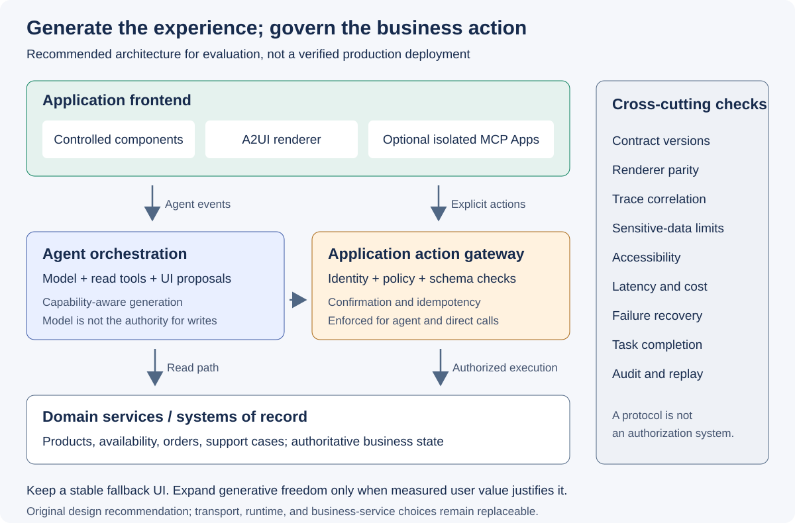

# Generative UI 도입 아키텍처와 평가 계획

**기준일: 2026-09-21. Screenshot 확인일: 2026-09-22.** 아래 내용은
[패턴 비교](../patterns/index.md),
[프로토콜 분석](../protocols/index.md), [Google 연구와 A2UI](../google-a2ui/index.md)를
바탕으로 한 **설계 권고와 향후 실험 계획**이다. 구현·성능·보안 적합성을
실증한 결과가 아니다.

## 질문

에이전트가 화면을 제안하면서도 사용자 통제, 브랜드 일관성, 업무 데이터의
정확성과 프런트엔드 교체 가능성을 유지하려면 무엇을 애플리케이션에 남겨야 하는가?

## 권장 책임 분리

*그림 5. 이 리서치의 설계 제안. AG-UI·A2UI·MCP Apps를 모두 채택해야
한다는 요구사항은 아니며, 업무 실행 게이트는 특정 프로토콜 기능이 아니다.*

| 책임 | 소유 주체 | 계약 |
|---|---|---|
| 사용자 의도 해석과 UI 제안 | 에이전트·오케스트레이터 | 사용 가능한 도구, 카탈로그와 출력 형식 |
| 렌더링·테마·접근성 | 프런트엔드·디자인 시스템 | 버전이 명시된 컴포넌트, 데이터 바인딩, 액션 |
| 인증·인가·입력 검증 | 서버의 업무 실행 계층 | 사용자 권한, 허용 액션, 매개변수 스키마 |
| 가격·재고·주문 등 사실 | 도메인 서비스 | 권위 있는 조회·변경 API |
| 이벤트 전달·상태 동기화 | 프로토콜 어댑터 | 이벤트 순서, 실행·도구 호출 식별자, 재연결 처리 |
| 평가·관측 | 애플리케이션 운영 계층 | 상관관계 ID, 지연·비용·실패·복구 측정 |

근거가 되는 공식 기능은 제한적이다. [A2UI][a2ui]는 선언적 UI와 클라이언트
렌더링을, [AG-UI][agui]는 이벤트와 공유 상태를, [MCP Apps][mcp-apps]는
호스트 내 UI와 도구 상호작용을 제공한다. 위 표의 권한 정책, 멱등성,
업무 감사와 평가 기준은 **애플리케이션에서 별도로 설계할 책임**이다.

## 가상의 소비자 서비스에 적용

### 제품 비교

“작은 공간에 맞는 제품 둘을 비교해 줘”라는 요청에서 비교 대상과 항목 선택은
에이전트가 도울 수 있다. 치수·가격·재고는 제품 API에서 받아 표시하고,
단위·통화·가격 유효 시점을 컴포넌트 계약에 포함한다.

처음에는 Controlled 비교 카드로 측정한다. 질의마다 비교 항목과 보조 설명
배치가 달라져야 한다면 Declarative 구성을 비교한다. 모델이 만든 가격이나
임의 HTML 안의 구매 버튼을 업무 API의 권위로 취급하지 않는다.

### 서비스 예약

증상 설명은 대화로 받고, 가능한 날짜·시간과 방문 조건은 폼으로 전환한다.
날짜 변경과 가용 슬롯 조회는 명시적인 UI 액션으로 처리하는 경로를 설계할 수
있다. 예약 확정은 서버에서 시간대, 사용자 권한, 슬롯의 최신 상태를 다시 확인한다.

UI가 “예약 완료”를 먼저 그렸다는 이유로 완료 처리하지 않는다. 실행 응답에
예약 식별자가 있을 때만 확정 상태로 전환하고, 중복 클릭에는 멱등성 키를 적용한다.

### 설명과 탐색

복잡한 기능을 설명하는 탐색형 시각화에는 Open-ended UI를 실험할 수 있다.
단, 거래 화면과 격리하고 생성 실패·긴 대기·키보드 사용 불가 시에는 텍스트나
검증된 기존 화면을 제공한다. 논문의 시각적 선호도를 예약 완료율이나
고객지원 해결률의 향상으로 바꾸어 해석하지 않는다.

## 프런트엔드 교체 가능성을 만드는 계약

프로토콜 이름보다 다음 산출물이 재사용 가능성을 결정한다.

1. 카탈로그에 컴포넌트 이름·속성·접근성 의미·상태·액션을 정의한다.
2. wire format 버전과 별개로 카탈로그 버전 및 지원 목록을 관리한다.
3. 실제 UI payload와 액션을 비식별화한 계약 테스트 fixture로 보존한다.
4. 동일 fixture를 대상 렌더러에서 재생해 정보, 동작, 오류 처리가 일치하는지
   검사한다. 픽셀 일치만 요구하지 않는다.
5. 알 수 없는 컴포넌트·기능·버전을 받으면 진단 가능한 오류와 안전한 대체
   화면을 표시한다. 조용히 항목을 삭제하거나 성공처럼 보여 주지 않는다.
6. 모델 교체와 렌더러 교체를 별도 실험으로 수행한다. 두 가지를 동시에
   바꾸면 회귀 원인을 구분하기 어렵다.

[Microsoft Agent Framework의 AG-UI 통합 문서][learn-agui]도 언어별
SDK 지원이 다름을 명시한다. 프로토콜을 공유한다는 이유로 모든 런타임의
도구 승인·상태 기능이 동일하다고 가정하면 안 된다.

또한 [해당 프레임워크의 MCP Apps 연동][learn-mcp]은 Python 에이전트
엔드포인트 앞의 TypeScript 미들웨어가 UI 리소스와 MCP 요청을 처리하는
구조다. 이 구조를 다른 호스트·SDK에 자동 적용되는 범용 배포 요건으로
일반화하지 않고, 실제 선택한 조합의 어댑터를 확인한다.

## 프로덕션 검토 체크리스트

아래는 취약점 감사 결과가 아니라 구현 전후에 검증해야 할 설계 요구사항이다.

| 영역 | 확인할 동작 | 실패 시 정책 |
|---|---|---|
| 출력 스키마 | 허용 컴포넌트·타입·데이터 경로만 렌더링 | 사용자에게 재시도·대체 화면을 제공하고 오류를 기록 |
| 업무 권한 | 서버가 사용자와 액션마다 권한 검사 | 명시적 거절, 원인에 맞는 사용자 안내 |
| 확인 단계 | 비용·주문·예약 등 부작용이 있는 액션의 확인 | 확인 취소 시 도구 실행 금지 |
| 상태 일관성 | 실행·도구 호출·surface 식별자와 버전 일치 | 오래된 응답 무시 사실을 기록하고 최신 상태 재조회 |
| 중복·재시도 | 요청이 반복되어도 부작용이 중복되지 않음 | 업무 API 멱등성, 처리 결과 조회 |
| 외부 콘텐츠 | iframe·URL·CSP·도구 노출 범위를 제한 | 허용되지 않은 경로 차단 및 이유 표시 |
| 개인정보 | 프롬프트·UI 데이터·로그 각각의 최소 수집 | 비식별화, 접근 제어, 보존·삭제 정책 |
| 접근성 | 키보드 탐색, 이름·역할, 포커스, 업데이트 알림 | 승인된 컴포넌트로 fallback, 완료 전 차단 이슈 해결 |
| 긴 실행 | 진행 상태·취소·타임아웃·최종 결과 구분 | 실패를 완료처럼 표현하지 않고 복구 경로 제공 |

LLM의 자연어 확신, 화면의 확인 버튼, MCP 도구 목록에 나타난다는 사실은
서버의 실행 권한을 대체하지 않는다.

## 단계별 도입

| 단계 | 산출물 | 다음 단계 진입 조건 |
|---|---|---|
| 0. 기준선 | 기존 화면과 Controlled UI, 동일한 업무 시나리오·데이터 | 성공·실패·지연을 같은 정의로 측정 가능 |
| 1. 계약 분리 | UI 카탈로그, 데이터·액션 스키마, 업무 실행 게이트 | 잘못된 출력·권한·중복 요청을 일관되게 처리 |
| 2. Declarative 실험 | 제한된 카탈로그의 A2UI 화면, 버전 고정 | 기준선 대비 가치가 있으며 접근성·정확성 회귀가 없음 |
| 3. 선택적 확장 | 두 번째 렌더러 또는 MCP Apps 경로 | 호환성·호스트 지원·격리 정책 검증 |
| 4. Open-ended 실험 | 읽기·설명 중심의 격리된 생성 UI | 대기 시간·비용·실패율을 포함한 평가에서 이점 확인 |

이 순서는 권장 실험 순서다. 이미 검증된 MCP 도구 UI가 있고 호스트 내
상호작용이 핵심인 경우에는 MCP Apps를 먼저 평가할 수 있다.

## 향후 Demo의 검증 설계

### 고정할 조건

- 같은 제품·서비스 fixture와 같은 사용자 업무를 사용한다.
- 모델·프롬프트·출력 제한·네트워크 조건·클라이언트·카탈로그 버전을 기록한다.
- 처음 방문, 후속 필터 조작, 재연결, 잘못된 입력, 권한 거절을 각각 시험한다.
- 테스트 계정과 가상 데이터만 사용한다. 실제 구매나 장치 제어는 수행하지 않는다.

### 제품 데모 자료를 근거로 쓰지 않는다

[리서치 요약](../index.md)에 수록한 Gemini dynamic view 화면처럼 공개된 제품
소개 자료는 도입 판단의 **출발점이지 측정값이 아니다.** 해당 영상도 화면
하단에 시퀀스를 단축하고 화면을 시뮬레이션했으며 호환성과 가용 범위가
다르다고 고지한다.

| 데모에서 알 수 있는 것 | 직접 측정해야 하는 것 |
|---|---|
| 어떤 경험이 가능한지, 어떤 화면 구성이 설득력 있는지 | 첫 화면 표시 시간과 처음으로 올바른 액션이 가능한 시간 |
| 어떤 시나리오를 비교군으로 삼을지 | 생성 실패율, 스키마 오류율, 복구 성공률 |
| 어떤 상호작용을 카탈로그로 만들지 | 키보드 탐색과 스크린 리더 동작, 업무 완료율 |

[패턴 비교](../patterns/index.md)에 수록한 AG-UI Dojo 화면처럼 직접 실행할 수
있는 공개 데모는 시나리오 후보를 고르는 데 쓴다. 이때도 Dojo의 통합·모델
조합과 제품의 조합이 다르면 결과를 그대로 옮기지 않는다.

### 비교군과 지표

| 비교 | 검증할 가설 | 측정 항목 |
|---|---|---|
| 기존 화면 vs Controlled | 대화 중 UI 전환이 업무 완료를 돕는가 | 완료율, 완료 시간, 수정 횟수, 사용자 오류 |
| Controlled vs Declarative | 가변 화면 조합이 실제로 필요한가 | 완료율, 이해도, 렌더 실패율, 카탈로그 재사용률 |
| 후속 액션의 모델 경유 vs 직접 도구 호출 | 추가 추론 없는 경로가 비용·지연을 줄이는가 | 액션당 모델 호출 수, p50·p95 지연, 업무 정확성 |
| 두 렌더러 | 동일 계약이 프런트 교체에 유효한가 | fixture 통과율, 빠진 컴포넌트, 액션·접근성 차이 |
| 텍스트 vs Open-ended | 표현 자유도의 가치가 대기 비용보다 큰가 | 첫 사용 가능 UI 시간, 완료 시간, 선호도, 실패율 |

첫 토큰 시간, 첫 화면 표시 시간, **처음으로 올바른 액션이 가능한 시간**은
분리해 기록한다. 일부 UI가 빨리 그려졌다는 사실만으로 작업을 더 빨리
끝낼 수 있다고 판단하지 않는다.

### 통과 조건을 정하는 방법

측정하지 않은 “지연 30% 감소” 같은 수치를 목표의 근거로 만들지 않는다.
실험 전 제품의 기존 SLO·기준선으로 지연·비용 상한과 표본 수를 합의한다.
다음은 운영 SLA가 아닌 **Demo용 제안 조건**이다.

- 정의한 권한 거절·확인 취소 시나리오에서 허용되지 않은 쓰기가 0건이어야 한다.
- 동일한 멱등성 키를 반복 전송해도 업무 변경은 한 번이어야 한다.
- 선언한 필수 카탈로그 fixture는 대상 렌더러 모두에서 통과해야 한다.
- 직접 호출 경로의 테스트 액션에는 불필요한 모델 호출이 0회인지 trace로
  확인한다. 이 경로 밖의 첫 자연어 요청과는 합산하지 않는다.
- 성능·사용성 이점이 없으면 Controlled 기준선을 유지한다. 새로운
  프로토콜을 사용했다는 사실 자체를 성공 지표로 삼지 않는다.

## 생태계 참여의 구체적인 형태

A2UI 참여는 우선 지원 버전을 고정하고, 필요한 카탈로그와 렌더러의 격차를
공개 이슈·테스트·명세 피드백으로 돌려주는 방식이 적절하다. 호환되지 않는
독자 필드를 계속 추가한 뒤 이를 “표준 지원”이라고 부르지 않는다.

AG-UI에는 에이전트 이벤트·상태·도구 호출의 어댑터 호환성 관점으로,
MCP Apps에는 호스트 기능·UI 자원·도구 노출 정책 관점으로 참여한다.
소유해야 할 것은 도메인 계약과 제품 경험이며, 생태계에 맡길 수 있는 것은
명확한 경계가 있는 통신·표현 계약이다.

## 한계

이 참조 구조는 E2E 구현과 사용자 실험을 거치지 않았다. 프로토콜 채택에 따른
비용 절감, 성능 향상, 보안 적합성 또는 프런트엔드 전환 성공을 보장하지 않는다.
다음 작업은 [리서치 요약](../index.md)의 결론을 재진술하는 Demo가 아니라,
위 표의 가설을 반증할 수 있는 작은 실험이어야 한다.

## 공식 출처

- [A2UI 공식 문서][a2ui]: 카탈로그 기반 선언적 UI와 클라이언트 렌더링.
- [CopilotKit AG-UI][agui]: 이벤트·상태·프런트엔드 도구의 연결.
- [MCP Apps 공식 개요][mcp-apps]: 호스트 내 UI와 양방향 도구 상호작용.
- [Microsoft Agent Framework AG-UI][learn-agui]: 언어별 구현 범위와 어댑터.
- [MCP Apps Compatibility with AG-UI][learn-mcp]: Microsoft Agent Framework와
  CopilotKit 미들웨어를 조합할 때의 책임 경계.

[a2ui]: https://a2ui.org/
[agui]: https://docs.copilotkit.ai/agentic-protocols/ag-ui
[mcp-apps]: https://modelcontextprotocol.io/extensions/apps/overview
[learn-agui]: https://learn.microsoft.com/agent-framework/integrations/by-component/ui/ag-ui/
[learn-mcp]: https://learn.microsoft.com/agent-framework/integrations/by-component/ui/ag-ui/mcp-apps
