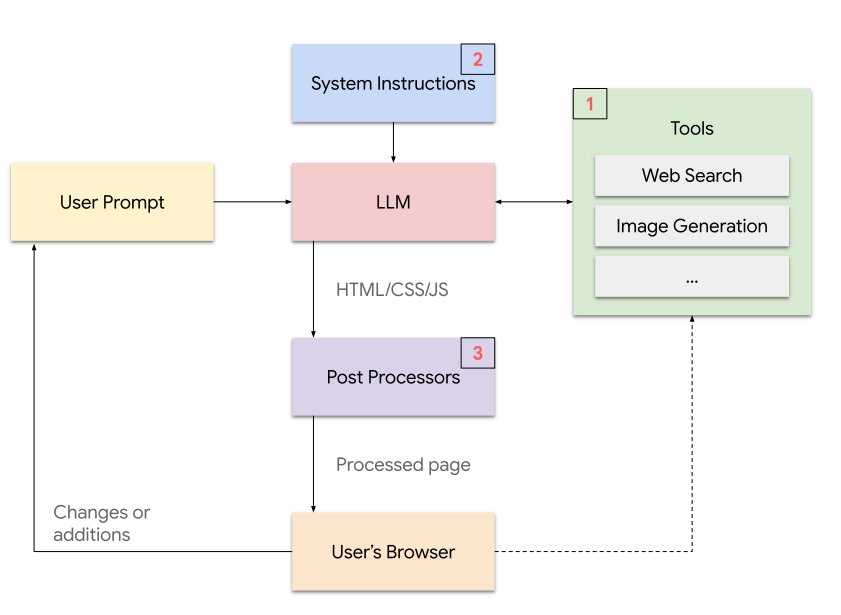
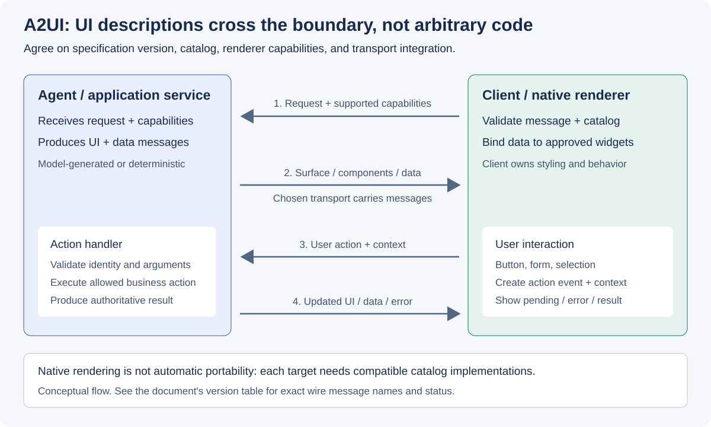

# Google Generative UI 연구와 A2UI의 설계 시사점

**기준일: 2026-09-21. Screenshot 확인일: 2026-09-22.** Google의 Generative UI
연구는 “모델이 인터페이스까지
생성하면 사용자 경험이 개선되는가”를 탐구한다. A2UI는 “에이전트가 만든 UI
표현을 클라이언트가 어떤 계약으로 렌더링하는가”를 다룬다.
**생성 능력의 연구와 UI 표현 프로토콜은 서로 다른 근거이며, 결합은 별도의
아키텍처 결정이다.**

## 논문 식별과 조사 기준

| 항목 | 확인 결과 |
|---|---|
| 제목 | *Generative UI: LLMs are Effective UI Generators* |
| 첫 저자 | **Yaniv Leviathan**. `Yaniv Levia` 또는 `Yaniv Levi`가 아니다. |
| 공동 저자 | Dani Valevski, Matan Kalman, Danny Lumen, Eyal Segalis, Eyal Molad, Shlomi Pasternak, Vishnu Natchu, Valerie Nygaard, Srinivasan (Cheenu) Venkatachary, James Manyika, Yossi Matias |
| 소속 표기 | Google Research |
| 정량 분석 기준 | [요청된 정적 PDF][paper]의 2026-09-21 조회본, 총 22쪽. 표지에는 “Preprint. Under review.” 표기 |
| 프로젝트 페이지 | [공식 연구 사이트][project]. 논문·결과 예시·PAGEN으로 연결 |

PDF와 프로젝트 페이지의 수치가 일부 다르므로 두 자료를 하나의 평가 버전으로
취급하지 않는다. 아래 정량 결과는 **정적 PDF의 페이지·표 번호**에 고정한다.
웹페이지의 BibTeX 연도만으로 출판 시점이나 심사 상태를 확정하지 않는다.

## 방법론: 모델·도구·후처리의 결합

{ style="background-color: white;" }

*Screenshot G1. Yaniv Leviathan 외, Google Research,
[공식 연구 사이트의 High Level Method Overview][project]에 게시된 원본 SVG.
[CC BY-SA 4.0](../licenses/google-CC-BY-SA-4.0.txt), 변경 없이 수록.
논문의 Figure 2와 대응하는 시스템 개요이며 A2UI 아키텍처 도식은 아니다.*

[로컬 원본 확대](../images/google-generative-ui-system-original.svg)

논문 §2, p.3의 구현은 완성된 웹 페이지와 이미지 등의 자산을 생성하고
브라우저에서 렌더링한다. 핵심 구성은 세 가지다.

1. 검색·이미지 생성 등 도구에 접근하는 서버 endpoint. 결과를 모델에 제공하는
   경로와 브라우저에 직접 제공하는 경로를 구분한다.
2. 목표, 계획 지침, 예시, 기술 규칙과 도구 사용법을 포함하는 시스템 지시.
3. 생성물의 알려진 오류를 보정하고 실행 오류를 관측하는 후처리.

이 연구는 자유로운 웹 UI 생성에 가깝다. A2UI JSON 카탈로그를 사용한
실험으로 제시되어 있지 않으며, 논문의 성과를 A2UI의 실증 성과라고 부를 수 없다.
또한 일부 자산이 브라우저에 직접 전달된다는 설명은 자연어 해석과 UI 생성에서
모델을 사용하지 않는다는 뜻이 아니다.

부록 A.5의 긴 시스템 프롬프트를 제품의 정답 템플릿으로 복제하기보다,
**과업 정의·도구 계약·표현 규칙·오류 피드백을 함께 설계했다는 원리**를
적용한다. 부록 A.6의 초기 연구용 후처리에는 API key placeholder 치환도
포함되지만, 이를 비밀 키의 브라우저 노출을 권장하는 운영 패턴으로 옮겨서는 안 된다.

## 정량 결과와 해석의 경계

### 평가 설계

PDF §3, pp.4–5와 부록 A.4, p.15에 따르면 LMArena에서 100개 요청을
추출한 뒤 8개를 제외했고, 별도로 64개의 정보 탐색 요청을 구성했다.
각 결과는 두 평가자에게 제시하여 좌측 선호·중립·우측 선호로 비교했다.
**미리 생성·캐시한 결과를 제시했기 때문에 생성 대기 시간은 평가에 포함되지 않는다.**

PAGEN은 이러한 요청에 대응하는 전문가 제작 웹 페이지의 비교 자료다.
외부 제작자 34명에게 연락했고 18명이 작업을 수락했다. 웹 페이지당 비용은
100–130달러, 평균 작업 시간은 3–5시간이었다. 제작자에게 AI 도구 사용도
허용했으므로 “AI를 전혀 쓰지 않은 인간과의 비교”라고 표현하지 않는다.

### 정적 PDF의 주요 수치

| 측정 | 결과 | 정확한 적용 범위 |
|---|---|---|
| Markdown 대비 Generative UI 선호 | 82.8% | LMArena 평가, Table 2, p.5 |
| Markdown 대비 Generative UI 선호 | 92.6% | 별도 Info-Seeking 평가, Table 7, p.13 |
| Generative UI ELO | 1710.7 | LMArena의 형식 간 비교, Table 1, p.5 |
| 전문가 웹 페이지 ELO | 1756.0 | 같은 비교. 전문가 결과가 더 높음 |
| 전문가 대비 Generative UI 승리 | 43.0% | Table 2. 초록·논의의 “최소한 동등” 44%와는 중립 포함 여부를 구분 |
| 생성 시간의 한계 | 종종 1–2분 | §6, p.7의 저자 설명. 본 리서치의 실측이 아님 |

ELO는 해당 비교 집합에서의 상대적 선호 척도이며 UI의 절대 정확도나
업무 성공률이 아니다. “82.8% 선호”를 구매 전환율·예약 완료율·개발 생산성
개선 수치로 변환할 근거는 없다.

### 모델과 프롬프트의 영향

PDF Table 3의 LMArena 모델 비교에서는 Gemini 3, Gemini 2.5 Pro,
Gemini 2.5 Flash의 출력 오류가 각각 0%, Gemini 2.0 Flash는 29%,
Gemini 2.0 Flash-Lite는 60%로 보고되었다.
이는 **해당 평가에서 관측한 출력 오류**이며 무오류 시스템이나 보안 검증을
의미하지 않는다. Info-Seeking의 결과는 다르므로 데이터셋을 섞어 일반화하지 않는다.

Table 5의 프롬프트 비교 ELO는 Full Prompt 1553.23, Minimal Prompt 1496.00,
No Philosophy 1450.77이다. 별도 비교군으로 계산한 ELO이므로 위 형식 비교의
1710.7과 직접 순위를 매기지 않는다. 제품 관점에서는 모델 교체와 함께
시스템 지시·도구·검증기를 공동 평가해야 한다는 시사점이 있다.

### 프로젝트 페이지와의 수치 불일치

| 항목 | 요청된 정적 PDF | 조사일의 프로젝트 페이지 |
|---|---|---|
| 전문가 결과와 최소한 동등 | 44% | 50% |
| 형식 비교의 Generative UI ELO | 1710.7 | 1736.2 |

두 출처에 서로 다른 값이 실제로 존재한다. 변경 이력과 평가 조건을 확인하지
않고 한쪽 수치를 다른 쪽 표의 결과로 인용하지 않는다. 이 문서에서는 PDF를
정량 근거로 유지하고, 프로젝트 사이트는 Screenshot·데모·별도 요약의 출처로 사용한다.

## 연구에서 제품으로: generative interfaces

[Gemini 3 앱 소개][gemini-app]는 이 방향을 **generative interfaces**라는
이름으로 제품에 도입했다고 밝히고, 첫 두 실험으로 visual layout과 dynamic
view를 설명한다. dynamic view 예시 화면은 [리서치 요약](../index.md)에
GIF로 수록했다.

제품화 사실에서 다음을 구분한다.

| 확인한 사실 | 확대 해석하지 않을 것 |
|---|---|
| Gemini 앱이 모델 생성 인터페이스를 실험으로 제공한다 | 모든 사용자·지역·요금제에서 동일하게 제공된다는 뜻은 아니다 |
| 소개 화면이 탐색형 UI의 가능성을 보여 준다 | 소개 영상에 “시퀀스 단축·화면 시뮬레이션” 고지가 있다 |
| Google이 연구와 제품을 연결했다 | 이 제품 기능이 **A2UI로 구현되었다는 공개 근거는 확인하지 않았다** |

마지막 항목이 특히 중요하다. 연구의 자유 웹 페이지 생성, 제품의 generative
interfaces, 그리고 A2UI의 선언적 카탈로그 렌더링은 같은 목표를 공유하지만
서로 다른 구현 경로다. 하나의 성과를 다른 쪽의 근거로 사용하지 않는다.

## A2UI: 생성 결과를 제품 UI 계약으로 제한

[A2UI 공식 문서][a2ui]는 에이전트가 실행 코드 대신 선언적 컴포넌트 기술을
보내고, 클라이언트가 자신의 위젯으로 렌더링하는 방식을 정의한다. 구조와
데이터를 분리하고, 작은 메시지로 UI를 생성·갱신하는 것이 핵심이다.

| 책임 | A2UI에서의 의미 | 구현 시 결정할 사항 |
|---|---|---|
| Surface | UI를 구성하는 독립 표시 영역 | 생성·삭제·재연결 수명주기 |
| Components | ID로 연결된 평탄한 컴포넌트 목록 | 허용 카탈로그와 native widget 매핑 |
| Data model | UI 구조와 분리된 상태 | JSON Pointer 바인딩, 데이터 최소 전송 |
| Actions | 사용자의 상호작용을 서버에 전달 | 서버 검증, 업무 실행, 오류·결과 처리 |
| Transport | A2UI 메시지를 전달하는 별도 계층 | 메시지 경계, 순서 보장, capability metadata |

카탈로그의 `catalogId`는 계약을 식별하는 문자열이다. URI 형태일 수 있지만
반드시 다운로드 가능한 주소라는 뜻은 아니다. 서버와 클라이언트가 같은
컴포넌트·함수 계약을 이해하는지가 호환성의 핵심이다.[v0.9.1 명세][spec091]

## Specification Versions

| 버전 | 조사일의 공식 상태 | 적용 판단 |
|---|---|---|
| v0.8 | Legacy | 기존 예제·도식에 남아 있는 메시지명을 해석할 때 사용 |
| v0.9 | Stable, 이전 안정 버전 | prompt-first 설계, `createSurface`, 모듈화된 카탈로그 계열 |
| **v0.9.1** | **Current** | 이 문서의 구체적인 메시지·E2E 설명 기준 |
| v1.0 | Candidate | 이전 draft의 v0.10 명칭과 구분. 운영 도입 시 renderer 지원을 별도 확인 |

상태는 [공식 홈][a2ui]과 [v0.9.1][spec091]·[v1.0 명세][spec10]에서 확인했다.
v0.9.1의 변경은 `application/a2ui+json` MIME type 통일과 활성 surface 사이의
ID 유일성 조건 정리다. [Evolution Guide][evolution091]는 v0.9와 v0.9.1
payload 호환을 명시하지만, 이것을 v0.8 또는 v1.0까지의 호환 보증으로 확대하지 않는다.

v1.0은 진행 중인 후보 명세다. 홈페이지의 짧은 변경 요약과 상세 명세의 기능
설명이 일치한다고 전제하지 않는다. 구현은 특정 revision의 schema와 renderer를
함께 고정하고, v0.9.1 예제에 candidate의 필드를 섞지 않는 것이 적절하다.

## Screenshot으로 보는 E2E

*Screenshot A1. A2UI 프로젝트, [공식 Data Flow 문서][data-flow].
[Apache-2.0](../licenses/a2ui-Apache-2.0.txt), 변경 없이 수록.
원본 revision과 재배포 정보는 [이미지 출처 기록](../licenses/third-party-images.txt)에 보존한다.*

[로컬 원본 확대](../images/a2ui-end-to-end-original.png)

> [!IMPORTANT]
> 이 Screenshot의 `surfaceUpdate`, `dataModelUpdate`, `beginRendering`,
> `userAction`은 **v0.8 계열**이다. 공식 사이트에 남아 있는 그림이라는 이유로
> 최신 wire format으로 사용하면 안 된다. SSE와 별도 A2A 메시지는 그림의
> 전달 방식이며, A2UI 자체가 이 조합만을 강제하는 것은 아니다.

| Screenshot의 표현 | v0.9.1에서 구분할 계약 |
|---|---|
| `surfaceUpdate` | `updateComponents` |
| `dataModelUpdate` | `updateDataModel` |
| `beginRendering` | 단순 치환이 아님. 먼저 `createSurface`, 이후 `root`와 컴포넌트·데이터를 점진적으로 제공 |
| `userAction` | `action` |
| 원래 SSE stream으로 갱신 | 선택한 transport의 framing·순서·재연결 계약에 맞춰 갱신 |

### v0.9.1 기준 상호작용

*그림 4. 현재 명세의 책임 경계를 설명하기 위해 직접 작성한 개념도.
Screenshot A1의 과거 메시지명을 그대로 사용하지 않는다.*

1. 클라이언트와 서버가 지원하는 카탈로그와 버전을 전달 계층의 metadata
   또는 초기화 절차에서 교환한다.
2. 서버가 `createSurface`로 surface와 `catalogId`를 지정한다.
3. `updateComponents`의 평탄한 목록과 ID 참조로 UI 구조를 기술한다.
   root 컴포넌트의 ID는 `root`이며, 자식 참조가 나중에 도착할 수 있다.
4. `updateDataModel`로 데이터를 제공한다. 구조를 모두 다시 보내지 않고
   특정 JSON Pointer 위치의 값을 갱신할 수 있다.
5. renderer가 허용된 native component와 데이터 바인딩을 적용한다.
6. 사용자 입력은 `action`으로 서버에 전달한다. `name`, `surfaceId`,
   `sourceComponentId`, `timestamp`, `context`가 포함된다.
7. 애플리케이션이 권한·인자·업무 규칙을 검증하고 실행한다. 후속 UI·데이터
   갱신 또는 오류를 반환하고, 수명이 끝나면 `deleteSurface`를 보낸다.

7번의 업무 권한 검사는 A2UI가 제공하는 자동 인가 기능이 아니라 설계 책임이다.
`sendDataModel`을 활성화하면 전체 data model이 metadata로 전송될 수 있으므로,
민감 필드를 UI 상태에 무분별하게 포함하지 않는다.

v0.9 계열은 prompt-first 생성 접근을 채택했다. 명세도 생성 후 검증의 필요성을
명시한다. `VALIDATION_FAILED` 오류에 surface·path·message를 담아 수정 경로를
구성하되, 재생성을 무제한 반복하거나 오류를 빈 화면으로 숨기지 않는다.

## 프런트엔드 독립성과 실제 renderer 지원

[공식 renderer 표][renderers]는 다음 상태를 표시한다. 이는 문서상 지원
상태이며 본 리서치에서 각 SDK를 설치해 검증한 결과는 아니다.

| Renderer | 플랫폼 | v0.9.1 | v1.0 |
|---|---|---|---|
| React | Web | Stable | Planned |
| Lit | Web Components | Stable | Planned |
| Angular | Web | Stable | Planned |
| Flutter GenUI SDK | Mobile·Desktop·Web | Stable | Planned |
| SwiftUI | iOS·macOS | 지원 표기 없음 | Planned |
| Jetpack Compose | Android | 지원 표기 없음 | Planned |

공식 표의 “지원 표기 없음”을 커뮤니티 구현의 부재로 해석하지 않는다.
같은 페이지는 별도의 커뮤니티 renderer도 소개한다.
특히 **Flutter를 통한 모바일 지원**과 **모든 플랫폼 native SDK의 동일 버전 지원**은
다른 주장이다.

## AG-UI와 결합할 때의 경계

v0.9.1 명세는 A2UI를 transport-agnostic으로 정의하고 A2A·AG-UI 등의
연결을 설명한다. A2UI는 JSON 표현의 의미, AG-UI는 에이전트와 앱의 이벤트
연결을 담당한다. 같은 사용자 경험에 조합할 수 있지만 실제 binding·버전·
카탈로그 지원을 검증해야 한다.

[Microsoft Agent Framework AG-UI 문서][learn-agui]도 이벤트로 도구·상태를
전달하고 클라이언트가 렌더링을 결정하는 경계를 확인해 준다.
이 사실이 해당 프레임워크의 모든 언어 SDK에 특정 A2UI renderer가 내장되어
있다는 근거는 아니다.

## Cutting-edge 설계 시사점

| 연구·명세에서 확인한 사실 | 권장하는 적용 |
|---|---|
| 생성 UI는 사전 생성 결과의 선호도 평가에서 높은 점수를 얻음 | 탐색·설명 과업에서 먼저 실험하고, 실제 대기 시간을 포함한 업무 완료율로 재평가 |
| 모델뿐 아니라 도구·지시·후처리가 함께 작동 | 모델 선정과 UI 검증·오류 복구를 하나의 시스템으로 설계 |
| A2UI가 구조·데이터·native renderer를 분리 | 도메인 카탈로그를 자산화하고 두 renderer의 동일 fixture 재생으로 교체 가능성 입증 |
| 버전·renderer 지원 상태가 다름 | schema·catalog·renderer·binding의 호환 조합을 고정 |
| 사용자 액션은 별도 반환 경로를 사용 | 후속 액션을 항상 LLM 추론으로 되돌리지 말고 결정적 처리 경로와 비교 |

전략의 중심은 **의도 적응형 경험과 검증 가능한 UI 계약의 결합**이다.
생태계 참여는 카탈로그·renderer·접근성·호환성 테스트의 기여로 구체화한다.
참여 자체를 프런트엔드 교체의 자유나 특정 기술의 장기 채택 보증으로 표현하지 않는다.

## 한계와 재현 범위

논문의 사용자 평가는 재현하지 않았다. 실제 서비스의 보안·접근성·지연·비용,
장기간 상태 유지와 업무 완료율도 이 논문의 수치만으로 입증되지 않는다.
논문·프로젝트 사이트의 수치 불일치는 위와 같이 명시하며 통합하지 않았다.

정적 PDF 조회본의 SHA-256은
`75aa3ca488b24af95f9d41eb27e834bcc55e68d911b4ce02c08ad73a02f9331a`다.
원문 PDF 전체는 이 저장소에 재배포하지 않는다. 수록한 Google 도식은
CC BY-SA 4.0이 표시된 연구 사이트의 SVG이며, PDF 전체의 재배포 허가를
추정한 것이 아니다.

## 공식 출처

- [정적 PDF][paper]: pp.1, 3–7, 13, 15, 21. 저자·방법·평가·PAGEN·한계.
- [연구 사이트][project]: 원천 시스템 도식, 별도의 결과 요약과 라이선스.
- [A2UI 공식 홈][a2ui]: 개념과 Specification Versions.
- [v0.9.1 명세][spec091]와 [Evolution Guide][evolution091]: 메시지·카탈로그·액션·전송 계약.
- [v1.0 Candidate 명세][spec10]: candidate 상태 확인.
- [Data Flow][data-flow]: 원천 E2E 도식과 v0.8·v0.9 예제의 구분.
- [Renderer 지원표][renderers]: 플랫폼·버전별 공개 지원 상태.
- [Microsoft Agent Framework AG-UI][learn-agui]: 이벤트 어댑터와 UI renderer 경계의 보조 사례.
- [Gemini 3 앱 소개][gemini-app]: generative interfaces의 제품 도입과 두 실험.

[paper]: https://generativeui.github.io/static/pdfs/paper.pdf
[project]: https://generativeui.github.io/
[a2ui]: https://a2ui.org/
[spec091]: https://a2ui.org/specification/v0.9.1-a2ui/
[spec10]: https://a2ui.org/specification/v1.0-a2ui/
[evolution091]: https://a2ui.org/specification/v0.9.1-evolution-guide/
[data-flow]: https://a2ui.org/concepts/data-flow/
[renderers]: https://a2ui.org/reference/renderers/
[learn-agui]: https://learn.microsoft.com/agent-framework/integrations/by-component/ui/ag-ui/
[gemini-app]: https://blog.google/products/gemini/gemini-3-gemini-app/
