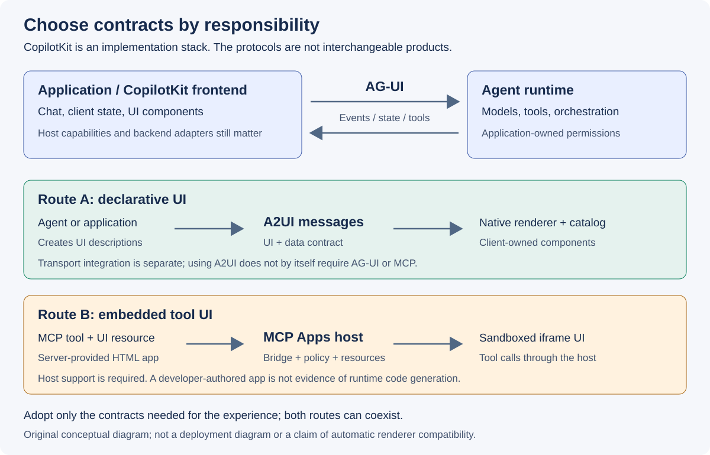

# Agentic Application의 Generative UI 설계 리서치

**조사 기준일: 2026-09-21.** 다음 세대 에이전트 애플리케이션의 차이는 답변을
더 길게 생성하는 데 있지 않다. 사용자가 비교하고, 값을 수정하고, 확인하고,
실행하는 데 필요한 인터페이스를 적절한 시점에 제공하는 데 있다.

이때 **UI를 얼마나 생성할 것인지, 어떤 프로토콜로 연결할 것인지, 누가 실제
업무 실행을 허가할 것인지**는 별개의 설계 결정이다. A2UI는 중요한 UI 표현
계약 후보지만, 모든 앱을 하나의 프로토콜로 대체하는 해답은 아니다.

## 30초 요약

| 질문 | 핵심 판단 |
|---|---|
| 무엇부터 도입하는가 | 기존 컴포넌트를 재사용하는 Controlled UI를 기준선으로 삼고, 화면 조합의 가변성이 가치가 있을 때 Declarative UI를 비교한다. 이는 이번 리서치의 권고이지 산업 전체의 성숙도 순위가 아니다. |
| 세 패턴은 어떻게 다른가 | Controlled는 개발자가 만든 컴포넌트를 선택하고, Declarative는 허용된 컴포넌트의 조합을 기술하며, Open-ended는 HTML·코드 수준의 표현 자유도를 허용한다. |
| AG-UI와 A2UI 중 하나를 고르는가 | 아니다. AG-UI는 에이전트와 앱의 이벤트·상태·도구 상호작용, A2UI는 선언적 UI 표현을 다룬다. 결합 시에는 실제 어댑터와 버전을 확인한다. |
| MCP Apps는 무엇을 추가하는가 | MCP 도구에 UI 리소스를 연결하고, 지원 호스트가 그 UI를 표시하며 도구와 양방향으로 상호작용하게 한다. 항상 LLM이 HTML을 새로 생성하는 것은 아니다. |
| LLM 없이 도구를 호출할 수 있는가 | 명시적인 버튼·필터 조작은 호스트를 통해 도구에 전달할 수 있다. 임의의 자연어를 이해하고 도구를 선택하는 단계까지 MCP가 대신한다는 뜻은 아니다. |
| A2UI를 채택하면 프런트를 자유롭게 바꾸는가 | UI 계약의 분리는 교체 비용을 줄일 수 있지만, 각 플랫폼의 렌더러·카탈로그·접근성·동작 호환성 구현은 남는다. |
| 논문이 무엇을 입증하는가 | 생성 UI의 가능성을 평가한 연구 결과와, 프로덕션의 지연·비용·안전성·프로토콜 호환성은 구분해야 한다. |

## 질문과 독자

대상은 에이전트 기반 제품을 설계하는 아키텍트, 프런트엔드 개발자, 에이전트
개발자와 기술 의사결정자다. 다음 질문에 답하는 것이 목표다.

1. 채팅 답변을 넘어 언제 UI 자체를 생성·선택해야 하는가?
2. CopilotKit, AG-UI, MCP Apps, A2UI는 어떤 책임을 분리하는가?
3. Google의 Generative UI 연구를 제품 설계에 어떻게 적용하고, 어디까지
   일반화하지 말아야 하는가?
4. 향후 Demo에서 어떤 가설을 검증해야 도입 여부를 판단할 수 있는가?

예시는 제품 비교, 서비스 예약, 고객지원 등 가상의 소비자 서비스 업무다.
특정 조직의 로드맵, 내부 시스템, 데이터 또는 도입 결정을 전제하지 않는다.

## 조사 범위와 방법

- CopilotKit의 분류 설명과 공개 저장소, AG-UI 문서, MCP Apps 공식 문서,
  A2UI 명세·문서, Google 연구 논문을 1차 자료로 사용한다.
- Microsoft Agent Framework의 공식 AG-UI 문서를 보조 구현 사례로
  교차 확인한다. 이 문서는 이벤트·상태·도구 호출을 통한 연결을 설명하며,
  언어별 SDK 지원 차이를 명시한다. 모든 런타임의 동일 지원을 뜻하지 않는다.
- 공개 명세의 사실, 논문 저자의 실험 결과, 이 리서치의 설계 권고를 구분한다.
- 버전 번호와 지원 상태는 조사일의 공개 문서 기준이다. 홈페이지의 표현과
  개별 구현·명세의 적용 범위가 다르면 더 좁은 범위를 따른다.
- SDK를 설치한 E2E 통합, 제품 성능 벤치마크, 실제 사용자 실험은 수행하지
  않았다. 문서·이미지·사이트 검증을 런타임 검증으로 표현하지 않는다.

## 프로토콜은 한 줄의 대체 관계가 아니다

*그림 1. 공식 문서의 책임 경계를 바탕으로 직접 작성한 개념도.
모든 블록을 반드시 배포해야 한다는 뜻은 아니다.*

| 구분 | 담당하는 계약 | 이것만으로 해결하지 않는 문제 |
|---|---|---|
| CopilotKit | 에이전트 UI를 만들기 위한 프런트엔드·런타임 구현 도구 | 업무 도메인 설계, 모든 프레임워크의 자동 호환 |
| AG-UI | 에이전트 실행에서 나오는 메시지·도구·상태 이벤트와 클라이언트 상호작용 | 범용 UI 컴포넌트 카탈로그, 서버 권한 정책 |
| A2UI | UI surface, 컴포넌트, 데이터와 사용자 액션을 기술하는 선언적 계약 | 모든 플랫폼의 렌더러 구현, 전송 계층과 업무 실행 |
| MCP | 도구·리소스 등을 노출하고 호출하는 통신 계약 | 자연어 이해, 업무 의도 추론, 화면 디자인 |
| MCP Apps | 도구와 연결된 UI 리소스 및 앱과 호스트 사이의 상호작용 | 모든 호스트의 지원, 임의 코드의 무조건적 안전성 |

근거는 [CopilotKit AG-UI 설명][agui], [MCP Apps 공식 개요][mcp-apps],
[A2UI 공식 문서][a2ui]다. “표준”이라는 표현은 여기서 공개 프로토콜·명세를
의미하며, 단일한 산업 표준의 확정이나 구현 간 무조건적인 상호운용성을 뜻하지 않는다.

## 목적별 읽는 순서

| 문서 | 핵심 질문 | 독자 |
|---|---|---|
| [세 가지 Generative UI 패턴](patterns/index.md) | 생성 자유도와 개발자 통제를 어떻게 선택하는가 | 제품·프런트엔드 설계자 |
| [CopilotKit와 프로토콜 조합](protocols/index.md) | AG-UI, MCP, MCP Apps는 어디에 연결되는가 | 에이전트·플랫폼 개발자 |
| [Google 연구와 A2UI](google-a2ui/index.md) | 논문의 근거와 A2UI 명세·E2E는 무엇이 다른가 | 아키텍트·연구 담당자 |
| [도입 아키텍처와 평가 계획](adoption/index.md) | 어떤 순서와 기준으로 제품에 도입하는가 | 기술 의사결정자·구현팀 |

방향 판단에는 이 요약과 도입 문서를, 설계에는 패턴·프로토콜·A2UI 문서를
함께 읽는다. 관련 자식 문서는 하나의 조사 기준일을 공유한다.

## Frontier 패턴에 대한 판단

유망한 방향은 “모든 화면을 매번 생성”하는 것이 아니라 **의도에 맞는 화면을
제안하되, 제품의 디자인 시스템과 실행 권한은 애플리케이션이 소유**하는 것이다.

가령 비교 대상과 비교 항목은 동적으로 구성하더라도, 가격·재고는 업무 API에서
조회하고 구매는 서버의 확인·권한 검사를 통과해야 한다. 설명용 시각화와 거래
실행 UI에 같은 자유도를 줄 필요가 없다.

A2UI 생태계 참여는 이 관점에서 평가한다. 실제 화면의 카탈로그를 정의하고,
지원 가능한 버전과 컴포넌트 범위를 공개하며, 렌더러 호환성 테스트와
접근성 개선에 기여하는 접근이 단순한 로고·프로토콜 채택보다 유용하다.
참여 자체가 프런트엔드 교체 비용을 없애거나 특정 기술의 장기 생존을
보장한다는 주장은 하지 않는다.

## 원천 도식과 로컬 열람

분석용 SVG 5개와 별도로, 공식 프로젝트가 재배포를 허용한 원천 도식 5개를
본문에 수록했다. 외부 페이지를 열지 않아도 패턴과 시스템 구성을 확인할 수
있으며, 각 그림의 설명은 원문 버전과 적용 범위를 구분한다.

| 원천 도식 | 수록 문서 | 재배포 조건 |
|---|---|---|
| CopilotKit Controlled 예시 | [패턴 비교](patterns/index.md) | MIT, 원본 유지 |
| CopilotKit Declarative 개요 | [패턴 비교](patterns/index.md) | MIT, 원본 유지 |
| AG-UI 공식 개요 | [프로토콜 조합](protocols/index.md) | MIT, 원본 유지 |
| Google Generative UI 시스템 | [Google 연구와 A2UI](google-a2ui/index.md) | CC BY-SA 4.0, 원본 유지 |
| A2UI E2E data flow | [Google 연구와 A2UI](google-a2ui/index.md) | Apache-2.0, v0.8 계열 표현임을 명시 |

[이미지 출처·revision·라이선스 기록](licenses/third-party-images.txt)과
라이선스 원문을 함께 보존한다. 특정 프로젝트의 로고가 포함된 도식은 원문
설명을 위한 인용 자료이며 해당 프로젝트의 보증·추천을 의미하지 않는다.

## 한계와 다음 검증

- 제공된 자료는 생태계 전체를 망라한 경쟁 제품 조사 목록이 아니다.
- 공식 프로젝트의 예제와 제품 소개는 통합 가능성을 보여 주는 자료이며,
  독립적인 운영 성능 증명으로 취급하지 않는다.
- UI 표현 계약을 분리해도 업무 데이터 스키마, 사용자 인증과 오류 처리 계약이
  강하게 결합되어 있으면 프런트엔드 교체 비용은 남는다.
- 향후 Demo는 이번 산출물에 포함하지 않는다. 구현을 시작한다면
  [평가 시나리오와 통과 조건](adoption/index.md)을 먼저 합의한다.

## 공식 출처

| 출처 | 이 페이지에서 사용한 범위 |
|---|---|
| [CopilotKit Generative UI][taxonomy] | 세 패턴과 생성·선택 통제의 구분 |
| [CopilotKit AG-UI][agui] | 앱과 에이전트의 연결, 이벤트와 공유 상태 |
| [MCP Apps][mcp-apps] | 도구 UI 리소스, 호스트 렌더링과 양방향 상호작용 |
| [A2UI][a2ui] | 선언적 UI, 클라이언트 렌더링과 버전별 명세 |
| [Google Generative UI 연구][paper-project] | 연구 범위와 평가 한계의 출발점 |
| [Microsoft Agent Framework AG-UI][learn-agui] | 프로토콜과 런타임 어댑터 경계의 보조 구현 사례 |

[taxonomy]: https://www.copilotkit.ai/generative-ui
[agui]: https://docs.copilotkit.ai/agentic-protocols/ag-ui
[mcp-apps]: https://modelcontextprotocol.io/extensions/apps/overview
[a2ui]: https://a2ui.org/
[paper-project]: https://generativeui.github.io/
[learn-agui]: https://learn.microsoft.com/agent-framework/integrations/by-component/ui/ag-ui/
