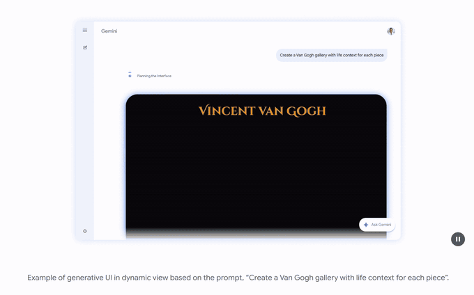

# Agentic Application의 Generative UI 설계 리서치

**조사 기준일: 2026-09-21. Screenshot 확인일: 2026-09-22.** 다음 세대 에이전트
애플리케이션의 차이는 답변을 더 길게 생성하는 데 있지 않다. 사용자가 비교하고,
값을 수정하고, 확인하고, 실행하는 데 필요한 인터페이스를 적절한 시점에 제공하는
데 있다.

이때 **UI를 얼마나 생성할 것인지, 어떤 프로토콜로 연결할 것인지, 누가 실제
업무 실행을 허가할 것인지**는 별개의 설계 결정이다. A2UI는 중요한 UI 표현
계약 후보지만, 모든 앱을 하나의 프로토콜로 대체하는 해답은 아니다.

## 30초 요약

| 질문 | 핵심 판단 |
|---|---|
| 무엇부터 도입하는가 | 기존 컴포넌트를 재사용하는 Controlled UI를 기준선으로 삼고, 화면 조합의 가변성이 가치가 있을 때 Declarative UI를 비교한다. 이는 이번 리서치의 권고이지 산업 전체의 성숙도 순위가 아니다. |
| 세 패턴은 어떻게 다른가 | Controlled는 개발자가 만든 컴포넌트를 선택하고, Declarative는 허용된 컴포넌트의 조합을 기술하며, Open-ended는 HTML·코드 수준의 표현 자유도를 허용한다. |
| AG-UI와 A2UI 중 하나를 고르는가 | 아니다. AG-UI는 에이전트와 앱의 이벤트·상태·도구 상호작용, A2UI는 선언적 UI 표현을 다룬다. 결합 시에는 실제 어댑터와 버전을 확인한다. |
| MCP Apps는 무엇을 추가하는가 | MCP 도구에 UI 리소스를 연결하고, 지원 호스트가 그 UI를 표시하며 도구와 양방향으로 상호작용하게 한다. 항상 LLM이 HTML을 새로 생성하는 것은 아니다. |
| LLM 없이 도구를 호출할 수 있는가 | 명시적인 버튼·필터 조작은 호스트를 통해 도구에 전달할 수 있다. 임의의 자연어를 이해하고 도구를 선택하는 단계까지 MCP가 대신한다는 뜻은 아니다. |
| A2UI를 채택하면 프런트를 자유롭게 바꾸는가 | UI 계약의 분리는 교체 비용을 줄일 수 있지만, 각 플랫폼의 렌더러·카탈로그·접근성·동작 호환성 구현은 남는다. |
| 논문이 무엇을 입증하는가 | 생성 UI의 가능성을 평가한 연구 결과와, 프로덕션의 지연·비용·안전성·프로토콜 호환성은 구분해야 한다. |

## 제품에서 확인하는 생성 UI



*Screenshot S1. Google, [Gemini 3 앱 소개][gemini-app]의 dynamic view 예시 영상을
GIF로 변환해 수록. 원본 화면 하단 고지처럼 **시퀀스를 단축하고 화면을 시뮬레이션한
소개 자료**이며 실제 생성 시간, 성공률이나 가용 범위를 나타내지 않는다.
저작권은 Google에 있고 설명을 위한 인용으로만 사용한다.*

이 화면이 “UI를 생성한다”의 구체적인 모습이다. 같은 프롬프트에 대해 Markdown
답변 대신 시대 구분 탭, 작품 이미지, 생애 맥락과 인용을 배치한 탐색형 화면이
돌아온다. Google은 이를 **generative interfaces**로 부르며, [Gemini 3 앱
소개][gemini-app]는 조사일 기준 visual layout과 dynamic view 두 가지를 첫
실험으로 설명한다.

다만 이 예시는 세 가지를 동시에 보여 준다.

- 표현 자유도가 큰 **설명·탐색 업무**다. 결제나 예약 확정이 걸려 있지 않다.
- 화면 배치·구성 요소를 모델이 결정하는 [Open-ended 계열](patterns/index.md)에
  가깝다. 제품의 디자인 시스템 컴포넌트를 재사용하는 방식이 아니다.
- 소개 영상은 **편집된 자료**다. 도입 판단에는 첫 화면 표시 시간, 실패율,
  접근성을 [직접 측정](adoption/index.md)해야 한다.

## Generative UI란 무엇인가

Generative UI는 모델이 **내용뿐 아니라 그 내용을 다루는 인터페이스까지**
만들어 내는 접근이다. 기존 LLM 애플리케이션은 결과를 Markdown 한 덩어리로
쏟아 냈다. 사용자는 그 텍스트를 읽고 다시 자연어로 되물어야 했다.

생성 UI는 이 흐름을 바꾼다. 요청의 성격에 맞는 카드, 비교표, 폼, 탐색형
화면을 그 자리에서 제시하고 사용자는 **읽는 대신 조작**한다. 값을 바꾸고,
항목을 고르고, 확인 버튼을 누르는 상호작용이 대화 안으로 들어온다.

여기서 세 가지 결정이 서로 다른 축이라는 점이 중요하다.

| 결정 축 | 질문 | 선택지 |
|---|---|---|
| **표현 자유도** | 모델이 화면의 무엇을 바꿀 수 있는가 | Controlled · Declarative · Open-ended |
| **연결 계약** | 에이전트와 앱이 무엇을 주고받는가 | AG-UI 이벤트 · A2UI 메시지 · MCP 도구·UI 리소스 |
| **실행 권한** | 누가 업무 변경을 허가하는가 | 애플리케이션 서버(프로토콜이 대신하지 않음) |

세 축을 한 덩어리로 묶으면 “새 프로토콜을 붙이면 더 좋은 UX가 된다”는 잘못된
기대가 생긴다. 반대로 축을 나누면 표현은 과감하게, 실행은 보수적으로 설계할
수 있다.

## 세 가지 방법론

[CopilotKit의 분류][taxonomy]를 기준으로 생성 UI는 세 갈래다. 성숙도 단계가
아니라 **선택지**이며, 하나의 제품에서 화면마다 다르게 적용해도 된다.

| 방법론 | 모델이 결정하는 것 | 개발자가 고정하는 것 | 잘 맞는 업무 | 주된 위험 |
|---|---|---|---|---|
| **Controlled** | 어떤 컴포넌트를 언제 어떤 값으로 보여 줄지 | 화면 구조, 상호작용, 디자인 시스템 | 주문·예약·승인처럼 절차가 안정적인 화면 | 필요한 컴포넌트가 없으면 대응 불가 |
| **Declarative** | 허용된 요소를 **어떻게 조합**할지 | 카탈로그, renderer, 속성·액션 계약 | 요청마다 비교 항목·구성이 달라지는 화면 | 카탈로그·버전 불일치, 데이터 검증 누락 |
| **Open-ended** | HTML·코드 수준의 표현 전체 | 격리 경계, 실행·리소스·접근 정책 | 설명·탐색형 시각화 | 생성 시간, 실패, 안전성 검증 비용 |

위에 수록한 Gemini dynamic view 화면이 Open-ended에 가까운 예라면,
[AG-UI Dojo의 날씨 카드](patterns/index.md)는 Controlled의 예다. 같은
“생성 UI”라는 말이 전혀 다른 구현과 검증 부담을 가리킨다.

권고는 단순하다. **Controlled를 기준선으로 두고, 조합의 가변성이 실제 가치를
만들 때 Declarative를 비교하며, Open-ended는 부작용 없는 업무부터 격리해
실험한다.** 자세한 비교는 [세 가지 방법론 문서](patterns/index.md)에 있다.

### 한 화면에서 비교하는 데모

<video controls muted playsinline preload="metadata" width="100%" src="images/demo-generative-ui.mp4">
세 가지 생성 UI 방식을 한 화면에서 비교하는 데모 영상입니다. 브라우저가
video 요소를 지원하지 않으면 재생할 수 없습니다.
</video>

*Screenshot S4. CopilotKit로 만든 “Generative UI Specs” 데모 애플리케이션의
화면 녹화(33초, 음성 없음). 이 리서치가 참고용으로 확인한 데모이며 공개
배포 주소는 확인하지 않았다. 화면의 값은 예시 데이터다.*

데모는 같은 앱 안에서 세 방식을 나란히 실행한다. 왼쪽 카드에서 방식을 고르고
오른쪽 채팅에서 요청하면 각 방식으로 UI가 생성된다.

| 데모의 표기 | 이 문서의 방법론 | 데모가 보여 주는 동작 |
|---|---|---|
| Static GenUI | Controlled | 도구 호출 시 미리 만든 React 컴포넌트(Weather·Stocks·Tasks)를 표시 |
| MCP Apps | Open-ended(호스트 내 도구 UI) | MCP 서버가 제공한 HTML/JS 앱(Flights·Trading·Calculator)을 iframe에 표시 |
| A2UI | Declarative | 에이전트가 만든 JSON UI(Contact Form·Todo List·Profile Card)를 런타임에 렌더링 |

데모의 Protocol Comparison 표도 같은 축을 쓴다. UI 정의는 React 컴포넌트 ·
HTML/JS 앱 · JSON schema로, 통제 주체는 프런트엔드 개발자 · MCP 서버 ·
AI 에이전트로 나뉜다. 이 문서가 표현 자유도와 실행 권한을 분리해 설명하는
이유가 화면으로 드러난다.

두 가지는 주의해서 읽는다. 첫째, 데모의 **Static GenUI는 현재 CopilotKit
문서의 Controlled와 같은 개념**이며 과거 명칭이다. 둘째, 한 앱이 세 방식을
모두 지원한다는 사실이 **세 방식을 모두 배포해야 한다는 뜻은 아니다.**

## CopilotKit 저장소를 어떻게 볼 것인가

이후 실제 개발 프레임워크를 고를 때를 대비해 [CopilotKit 공개
저장소][copilotkit]의 성격만 짧게 정리한다.

- **위치**: 에이전트와 사용자 사이의 수평 계층을 자처하는 풀스택 SDK다.
  React 라이브러리로 시작했고 현재는 React·Angular·Vue·React Native와
  Slack·Microsoft Teams 같은 표면을 함께 다룬다고 설명한다.
- **기능 축**: Chat UI, Backend Tool Rendering, Generative UI, Shared State,
  Human-in-the-Loop가 별도 기능으로 나열된다. 생성 UI가 전체가 아니라
  **하나의 축**이라는 점이 이 문서의 구분과 일치한다.
- **프로토콜 관계**: 저장소는 자신을 AG-UI 프로토콜의 주관 주체로 소개하고
  Google·LangChain·AWS·Microsoft 등의 채택을 언급한다. 채택 주장과 개별
  기능의 동등한 지원은 구분해 확인한다.
- **시작 경로**: `npx copilotkit@latest create`로 새 프로젝트를 만들고,
  기존 앱에는 onboarding CLI를 사용하는 흐름을 안내한다. PoC를 빠르게 세울
  때 유용한 출발점이다.
- **운영 확장**: 스레드 영속화, 사용자 메모리, 분석 같은 항목은
  CopilotKit Intelligence라는 **별도 제품**으로 분리되어 있고 자체 호스팅
  옵션을 제공한다. 오픈소스 SDK의 범위와 혼동하지 않는다.

## 어떤 프레임워크에 적용할 수 있는가

프런트엔드 프레임워크 지원은 **계층마다 다르다.** “React·Vue·Angular를
지원한다”는 말은 어느 계층의 이야기인지 확인해야 한다. 조사일의 공식 문서
기준은 다음과 같다.

| 계층 | React | Vue | Angular | 그 밖의 확인 사항 |
|---|---|---|---|---|
| CopilotKit 프런트엔드 | 1st party | 1st party (`@copilotkit/vue`, Vue 3.3+) | 1st party (`@copilotkit/angular`, Angular 22 signal 기반) | React Native·React SPA 별도 가이드 제공 |
| A2UI 공식 renderer | Stable(v0.9.1) | **공식 renderer 없음** | Stable(v0.9.1) | Lit(Web Components), Flutter GenUI SDK도 Stable |
| MCP Apps의 앱(iframe 내부) | 시작 템플릿 제공 | 시작 템플릿 제공 | 공식 템플릿 없음 | 표준 웹 기술이면 프레임워크 무관 |

읽는 방법은 다음과 같다.

- **Vue로 A2UI를 쓰려면** 공식 renderer가 없으므로 Lit renderer를 Web
  Components로 끼우거나 커뮤니티 구현을 검토해야 한다. CopilotKit이 Vue를
  지원한다는 사실과는 별개의 문제다.
- **Angular는** CopilotKit과 A2UI 양쪽에 공식 경로가 있다. 다만 Angular 22,
  Node.js 22처럼 요구 버전이 명시되어 있으므로 기존 앱의 버전을 먼저 본다.
- **MCP Apps의 앱은** 호스트 안 iframe에서 동작하는 독립 웹 앱이다. 여기서의
  프레임워크 선택은 호스트가 아니라 앱 개발자의 자유다.

백엔드 쪽은 프로토콜 어댑터의 문제다. AG-UI는 Microsoft Agent Framework,
LangGraph 등 여러 에이전트 런타임과 연결되지만 **언어별 SDK의 지원 범위가
다르다.** MCP Apps는 호스트가 지원해야 표시되며, 조사일 공식 문서는 Claude,
Claude Desktop, VS Code GitHub Copilot, Microsoft 365 Copilot 등을 지원
호스트로 나열한다.

즉 기술 선택은 “무엇을 지원하는가”가 아니라 **“내가 쓰는 프레임워크·런타임·
호스트의 조합에서 무엇이 Stable인가”**로 좁혀야 한다. 계층별 근거는
[프로토콜 조합 문서](protocols/index.md)와
[A2UI renderer 표](google-a2ui/index.md)에서 확인한다.

## 질문과 독자

대상은 에이전트 기반 제품을 설계하는 아키텍트, 프런트엔드 개발자, 에이전트
개발자와 기술 의사결정자다. 다음 질문에 답하는 것이 목표다.

1. 채팅 답변을 넘어 언제 UI 자체를 생성·선택해야 하는가?
2. CopilotKit, AG-UI, MCP Apps, A2UI는 어떤 책임을 분리하는가?
3. Google의 Generative UI 연구를 제품 설계에 어떻게 적용하고, 어디까지
   일반화하지 말아야 하는가?
4. 향후 Demo에서 어떤 가설을 검증해야 도입 여부를 판단할 수 있는가?

예시는 제품 비교, 서비스 예약, 고객지원 등 가상의 소비자 서비스 업무다.
특정 조직의 로드맵, 내부 시스템, 데이터 또는 도입 결정을 전제하지 않는다.

## 조사 범위와 방법

- CopilotKit의 분류 설명과 공개 저장소, AG-UI 문서, MCP Apps 공식 문서,
  A2UI 명세·문서, Google 연구 논문을 1차 자료로 사용한다.
- Microsoft Agent Framework의 공식 AG-UI 문서를 보조 구현 사례로
  교차 확인한다. 이 문서는 이벤트·상태·도구 호출을 통한 연결을 설명하며,
  언어별 SDK 지원 차이를 명시한다. 모든 런타임의 동일 지원을 뜻하지 않는다.
- 공개 명세의 사실, 논문 저자의 실험 결과, 이 리서치의 설계 권고를 구분한다.
- 버전 번호와 지원 상태는 조사일의 공개 문서 기준이다. 홈페이지의 표현과
  개별 구현·명세의 적용 범위가 다르면 더 좁은 범위를 따른다.
- SDK를 설치한 E2E 통합, 제품 성능 벤치마크, 실제 사용자 실험은 수행하지
  않았다. 문서·이미지·사이트 검증을 런타임 검증으로 표현하지 않는다.

## 프로토콜은 한 줄의 대체 관계가 아니다


*그림 1. 공식 문서의 책임 경계를 바탕으로 직접 작성한 개념도.
모든 블록을 반드시 배포해야 한다는 뜻은 아니다.*

| 구분 | 담당하는 계약 | 이것만으로 해결하지 않는 문제 |
|---|---|---|
| CopilotKit | 에이전트 UI를 만들기 위한 프런트엔드·런타임 구현 도구 | 업무 도메인 설계, 모든 프레임워크의 자동 호환 |
| AG-UI | 에이전트 실행에서 나오는 메시지·도구·상태 이벤트와 클라이언트 상호작용 | 범용 UI 컴포넌트 카탈로그, 서버 권한 정책 |
| A2UI | UI surface, 컴포넌트, 데이터와 사용자 액션을 기술하는 선언적 계약 | 모든 플랫폼의 렌더러 구현, 전송 계층과 업무 실행 |
| MCP | 도구·리소스 등을 노출하고 호출하는 통신 계약 | 자연어 이해, 업무 의도 추론, 화면 디자인 |
| MCP Apps | 도구와 연결된 UI 리소스 및 앱과 호스트 사이의 상호작용 | 모든 호스트의 지원, 임의 코드의 무조건적 안전성 |

근거는 [CopilotKit AG-UI 설명][agui], [MCP Apps 공식 개요][mcp-apps],
[A2UI 공식 문서][a2ui]다. “표준”이라는 표현은 여기서 공개 프로토콜·명세를
의미하며, 단일한 산업 표준의 확정이나 구현 간 무조건적인 상호운용성을 뜻하지 않는다.

## 목적별 읽는 순서

| 문서 | 핵심 질문 | 독자 |
|---|---|---|
| [세 가지 Generative UI 패턴](patterns/index.md) | 생성 자유도와 개발자 통제를 어떻게 선택하는가 | 제품·프런트엔드 설계자 |
| [CopilotKit와 프로토콜 조합](protocols/index.md) | AG-UI, MCP, MCP Apps는 어디에 연결되는가 | 에이전트·플랫폼 개발자 |
| [Google 연구와 A2UI](google-a2ui/index.md) | 논문의 근거와 A2UI 명세·E2E는 무엇이 다른가 | 아키텍트·연구 담당자 |
| [도입 아키텍처와 평가 계획](adoption/index.md) | 어떤 순서와 기준으로 제품에 도입하는가 | 기술 의사결정자·구현팀 |

방향 판단에는 이 요약과 도입 문서를, 설계에는 패턴·프로토콜·A2UI 문서를
함께 읽는다. 관련 자식 문서는 하나의 조사 기준일을 공유한다.

## Frontier 패턴에 대한 판단

유망한 방향은 “모든 화면을 매번 생성”하는 것이 아니라 **의도에 맞는 화면을
제안하되, 제품의 디자인 시스템과 실행 권한은 애플리케이션이 소유**하는 것이다.

가령 비교 대상과 비교 항목은 동적으로 구성하더라도, 가격·재고는 업무 API에서
조회하고 구매는 서버의 확인·권한 검사를 통과해야 한다. 설명용 시각화와 거래
실행 UI에 같은 자유도를 줄 필요가 없다.

A2UI 생태계 참여는 이 관점에서 평가한다. 실제 화면의 카탈로그를 정의하고,
지원 가능한 버전과 컴포넌트 범위를 공개하며, 렌더러 호환성 테스트와
접근성 개선에 기여하는 접근이 단순한 로고·프로토콜 채택보다 유용하다.
참여 자체가 프런트엔드 교체 비용을 없애거나 특정 기술의 장기 생존을
보장한다는 주장은 하지 않는다.

## 한계와 다음 검증

- 제공된 자료는 생태계 전체를 망라한 경쟁 제품 조사 목록이 아니다.
- 공식 프로젝트의 예제와 제품 소개는 통합 가능성을 보여 주는 자료이며,
  독립적인 운영 성능 증명으로 취급하지 않는다.
- UI 표현 계약을 분리해도 업무 데이터 스키마, 사용자 인증과 오류 처리 계약이
  강하게 결합되어 있으면 프런트엔드 교체 비용은 남는다.
- 이번 산출물은 문서 조사와 화면 확인까지다. 아래 진행 방향은 계획이며
  구현·측정 결과가 아니다.

## 향후 Demo 및 진행 방향

### 1단계: PoC 컨셉 데모 (code-level)

목표는 “세 방식이 같은 업무에서 어떻게 다른가”를 **코드로 비교 가능한 상태**로
만드는 것이다. 위 데모처럼 하나의 앱에서 세 방식을 전환할 수 있으면 충분하다.

| 항목 | PoC 기준 |
|---|---|
| 업무 시나리오 | 가상의 제품 비교와 예약 확정 하나씩. 읽기와 쓰기를 모두 포함한다 |
| 프런트엔드 | 팀의 주력 프레임워크 하나로 고정한다. React·Vue·Angular 중 A2UI renderer 지원 여부를 먼저 확인한다 |
| 연결 계층 | AG-UI 엔드포인트 하나. 백엔드 런타임은 교체 실험 대상으로 남긴다 |
| Controlled | 기존 디자인 시스템 컴포넌트를 도구 호출에 매핑한다 |
| Declarative | 컴포넌트 5~10개의 최소 A2UI 카탈로그와 버전을 고정한다 |
| Open-ended | 부작용 없는 설명 화면에만 적용하고 iframe·CSP 정책을 명시한다 |
| 실행 게이트 | 예약 확정은 서버에서 권한·슬롯·멱등성 키를 재검증한다 |
| 계측 | 모델 호출 수, 첫 화면 표시 시간, 첫 정상 액션 가능 시간, 실패율 |

산출물은 화면 몇 개가 아니라 **재생 가능한 fixture**다. UI payload와 액션을
비식별화해 저장하면 2단계의 렌더러 교체 실험에 그대로 쓸 수 있다.

시작 경로로는 `npx copilotkit@latest create` 같은 스캐폴딩이 빠르지만, PoC의
목적은 프레임워크 학습이 아니라 **계약 검증**이다. 카탈로그·스키마·권한
경계를 우리 코드로 소유하는지 확인하면서 진행한다.

### 2단계: Global Production 기준 고려 사항

PoC가 통과해도 전 세계 사용자를 대상으로 하는 운영은 별도 요구사항을 만든다.

| 영역 | 확인할 것 |
|---|---|
| 지연·지역 | 모델·런타임·정적 자산의 리전 배치. 생성 지연은 지역별로 다르게 체감된다 |
| 비용 | 화면 1회 생성당 토큰·도구 호출 비용. 직접 액션 경로로 추론을 줄일 여지 |
| 현지화 | 생성된 문구·날짜·통화·단위. 카탈로그 컴포넌트가 RTL과 긴 문자열을 견디는지 |
| 접근성 | 키보드 탐색, 이름·역할, 포커스 이동, 동적 갱신 알림. 지역별 법규 요구 수준 |
| 데이터 보호 | 프롬프트·UI 데이터·로그의 저장 위치와 보존 기간. 지역별 이전 제약 |
| 안전성 | 생성 콘텐츠 검수, 외부 리소스 허용 목록, iframe 격리와 권한 최소화 |
| 가용성 | 생성 실패·타임아웃 시의 검증된 대체 화면. 실패를 완료처럼 보이지 않게 한다 |
| 버전 관리 | schema·카탈로그·renderer·호스트의 호환 조합 고정과 단계적 롤아웃 |
| 운영 관측 | 상관관계 ID로 생성·렌더·액션·업무 실행을 연결한 추적 |
| 조직 | 스레드 영속화·메모리·분석 기능을 직접 만들지, 별도 제품을 쓸지의 경계 |

특히 **비용과 지연은 기능이 아니라 제품 결정**이다. 모든 화면을 생성하는
대신 자주 쓰는 조합을 카탈로그로 고정하면 품질과 비용을 함께 잡을 수 있다.
평가 기준과 통과 조건은 [도입 아키텍처와 평가 계획](adoption/index.md)에서
합의한 뒤 시작한다.

## 공식 출처

| 출처 | 이 페이지에서 사용한 범위 |
|---|---|
| [CopilotKit Generative UI][taxonomy] | 세 패턴과 생성·선택 통제의 구분 |
| [CopilotKit AG-UI][agui] | 앱과 에이전트의 연결, 이벤트와 공유 상태 |
| [MCP Apps][mcp-apps] | 도구 UI 리소스, 호스트 렌더링과 양방향 상호작용 |
| [A2UI][a2ui] | 선언적 UI, 클라이언트 렌더링과 버전별 명세 |
| [Google Generative UI 연구][paper-project] | 연구 범위와 평가 한계의 출발점 |
| [Microsoft Agent Framework AG-UI][learn-agui] | 프로토콜과 런타임 어댑터 경계의 보조 구현 사례 |
| [Gemini 3 앱 소개][gemini-app] | generative interfaces와 dynamic view 화면의 출처 |
| [CopilotKit 저장소][copilotkit] | SDK의 기능 축, 지원 프런트엔드와 시작 경로 |
| [CopilotKit Vue 프런트엔드][ck-vue] | Vue 3.3+ 1st party 지원 범위 |
| [CopilotKit Angular 프런트엔드][ck-angular] | Angular 22 signal 기반 지원 범위 |
| [A2UI Renderer 지원표][renderers] | 프레임워크별 공식 renderer 상태 |

## 참고 문서

### 문서와 자산 구조

이 주제는 entry 문서 하나와 자식 문서 넷, 그리고 공용 자산 폴더로 구성한다.
모든 이미지는 `images/` 한 곳에 두며 문서별 하위 폴더를 만들지 않는다.

```text
agentic-app-genui/
├── index.md              ← 이 문서(전체 요약과 읽는 순서)
├── patterns/index.md     ← 세 가지 방법론 비교
├── protocols/index.md    ← CopilotKit·AG-UI·MCP Apps 책임 분리
├── google-a2ui/index.md  ← Google 연구와 A2UI 명세
├── adoption/index.md     ← 도입 아키텍처와 평가 계획
├── images/               ← 모든 그림과 영상을 한 폴더에 보관
│   ├── *.svg                        직접 작성한 분석용 개념도 5개
│   ├── *-original.png|svg           재배포가 허용된 공식 원본 도식 5개
│   ├── *-screenshot.png             공개 페이지·데모 화면 캡처 2개
│   ├── gemini-dynamic-view-screencast.gif   제품 소개 영상 축약본
│   └── demo-generative-ui.mp4       세 방식 비교 데모 화면 녹화
└── licenses/             ← 라이선스 원문과 출처·SHA-256 기록
```

파일 이름이 곧 자산의 성격을 나타낸다. 접미사가 없는 SVG는 이 리서치가
직접 작성한 도식, `-original`은 공식 프로젝트의 원본 도식, `-screenshot`과
영상 파일은 공개 페이지·데모를 캡처한 자료다.

### 수록한 그림 목록

| 공식 원본 도식 | 수록 문서 | 재배포 조건 |
|---|---|---|
| CopilotKit Controlled 예시(C1) | [패턴 비교](patterns/index.md) | MIT, 원본 유지 |
| CopilotKit Declarative 개요(C2) | [패턴 비교](patterns/index.md) | MIT, 원본 유지 |
| AG-UI 공식 개요(P1) | [프로토콜 조합](protocols/index.md) | MIT, 원본 유지 |
| Google Generative UI 시스템(G1) | [Google 연구와 A2UI](google-a2ui/index.md) | CC BY-SA 4.0, 원본 유지 |
| A2UI E2E data flow(A1) | [Google 연구와 A2UI](google-a2ui/index.md) | Apache-2.0, v0.8 계열 표현임을 명시 |

| Screenshot | 수록 문서 | 출처와 사용 조건 |
|---|---|---|
| S1. Gemini dynamic view 화면 녹화(GIF) | 이 문서 | [Gemini 3 앱 소개][gemini-app]. 편집된 소개 영상, 인용 |
| S2. AG-UI Dojo 실행 화면 | [패턴 비교](patterns/index.md) | [AG-UI Dojo][dojo]. 공개 데모 실행 화면, 인용 |
| S3. CopilotKit 제품 소개 화면 | [프로토콜 조합](protocols/index.md) | [제품 페이지][copilotkit-product]. 벤더 주장, 인용 |
| S4. 세 방식 비교 데모 녹화(MP4) | 이 문서 | CopilotKit 기반 데모 애플리케이션. 공개 배포 주소 미확인 |

Screenshot은 원문의 주장과 화면 구성을 설명하기 위한 인용이며 저작권은 각
저작자에게 있다. 사용한 조합의 동작을 이 저장소가 검증했다는 뜻이 아니다.
S1의 GIF는 원본 영상을 8fps·680px로, S4의 MP4는 1280px·30fps·무음으로 다시
인코딩한 축약본이다. Google 연구 사이트의 방법 개요는 같은 그림을 공식
SVG(G1)로 이미 수록했으므로 화면 캡처를 따로 두지 않는다.

[이미지 출처·revision·라이선스 기록](licenses/third-party-images.txt)과
라이선스 원문을 함께 보존한다. 특정 프로젝트의 로고가 포함된 도식은 원문
설명을 위한 인용 자료이며 해당 프로젝트의 보증·추천을 의미하지 않는다.

[copilotkit-product]: https://www.copilotkit.ai/product
[dojo]: https://dojo.ag-ui.com/
[taxonomy]: https://www.copilotkit.ai/generative-ui
[agui]: https://docs.copilotkit.ai/agentic-protocols/ag-ui
[mcp-apps]: https://modelcontextprotocol.io/extensions/apps/overview
[a2ui]: https://a2ui.org/
[paper-project]: https://generativeui.github.io/
[learn-agui]: https://learn.microsoft.com/agent-framework/integrations/by-component/ui/ag-ui/
[gemini-app]: https://blog.google/products/gemini/gemini-3-gemini-app/
[copilotkit]: https://github.com/CopilotKit/CopilotKit
[ck-vue]: https://docs.copilotkit.ai/vue
[ck-angular]: https://docs.copilotkit.ai/angular
[renderers]: https://a2ui.org/reference/renderers/
