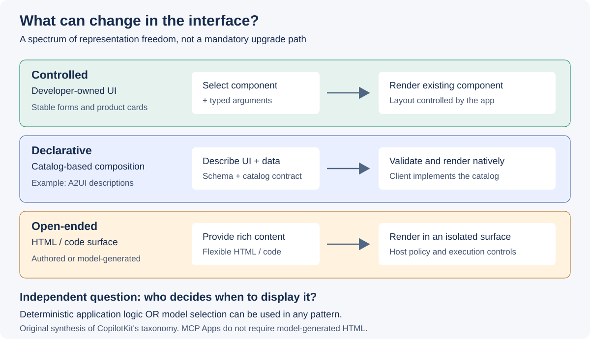
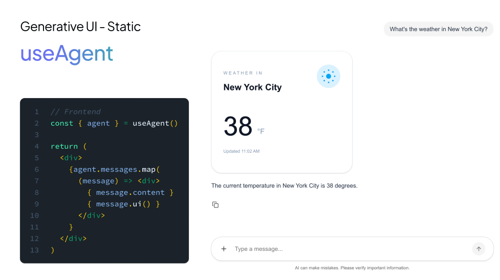
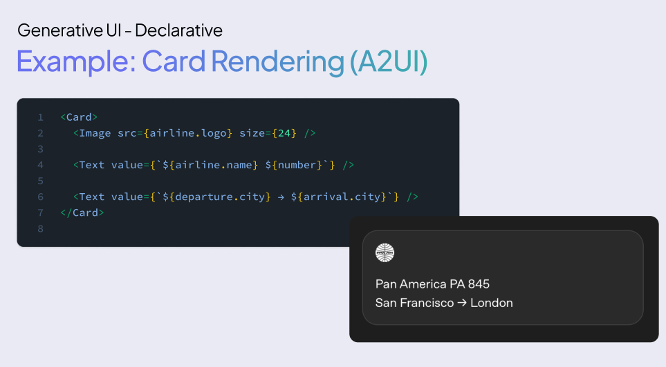

# Controlled·Declarative·Open-ended Generative UI 패턴

**기준일: 2026-09-21.** [CopilotKit의 Generative UI 분류][taxonomy]는
에이전트 기반 인터페이스의 표현 방식을 이해하기 위한 틀이다. 세 패턴은
서로 배타적인 제품 목록도, Controlled에서 Open-ended로 이동해야 한다는
성숙도 단계도 아니다.

조사일의 원문은 **Open**을 현재 이름, **Open-ended**를 이전 이름으로 함께
설명한다. 이 문서는 요청 범위와의 연결을 위해 Open-ended 표기를 유지한다.
Controlled도 과거 자료에서는 Static으로 나타난다. 현재 소개 페이지는
MCP Apps를 세 패턴 옆의 **special case**로 분리한다.

## 질문

모델이 **무엇을 바꿀 수 있도록 허용할 것인가?** 컴포넌트 선택만 허용할지,
컴포넌트 조합을 허용할지, HTML·코드까지 생성하게 할지에 따라 테스트 대상과
실패 방식이 달라진다.

*그림 2. CopilotKit의 분류를 바탕으로 직접 작성한 비교도.
패턴의 이름과 실제 적용 권고를 구분한다.*

## 결과: 세 패턴 비교

| 축 | Controlled | Declarative | Open-ended |
|---|---|---|---|
| 주된 표현 | 이미 구현된 UI 컴포넌트와 인자 | 허용된 UI 요소의 선언적 구성과 데이터 | HTML·코드 등 더 자유로운 표현 |
| 개발자가 고정하는 것 | 컴포넌트의 화면 구조·상호작용 | 카탈로그, renderer, 속성·액션 계약 | 호스트 경계, 실행·리소스·접근 정책 |
| 에이전트에 허용하는 선택 | 어떤 컴포넌트를 언제 어떤 값으로 표시할지 | 어떤 허용 요소를 어떻게 구성할지 | 허용된 실행 환경 내 콘텐츠·표현 방식 |
| 대표적인 연결 방식 | 도구 호출과 기존 UI의 매핑 | A2UI 같은 선언적 UI 계약 | 생성 HTML 또는 별도로 작성된 도구 UI |
| 주된 테스트 단위 | 도구 스키마, 인자, 컴포넌트 상태 | payload, 카탈로그, 데이터·액션 바인딩 | 생성물 동작, 격리, 외부 리소스, 콘텐츠 품질 |
| 적합성을 검토할 업무 | 가격 카드, 예약 폼, 승인 UI | 요청에 따라 달라지는 비교·요약·다단계 화면 | 설명용 시각화, 탐색형 콘텐츠 |

분류·표현 방식은 [CopilotKit][taxonomy]에 근거한다. 테스트 단위와 업무 예시는
이를 제품 개발에 적용하기 위한 이번 리서치의 분석이다.

## Controlled: 만들어 둔 UI를 올바른 순간에 제공

*원천 도식 C1. CopilotKit, 공식 Generative UI showcase의
[Controlled 예시][showcase]. [MIT](../licenses/copilotkit-MIT.txt), 변경 없이 수록.
그림·샘플의 API 이름은 해당 revision의 예시이며 최신 SDK 전체에 대한 API 보증이 아니다.*

[로컬 원본 확대](../images/copilotkit-controlled-original.png)

개발자가 제품 카드, 비교표, 예약 폼을 미리 구현한다. 에이전트의 도구 호출이나
애플리케이션 상태에 맞춰 컴포넌트를 선택하고 구조화된 값을 전달한다.

장점은 기존 디자인 시스템, 접근성 검사, 오류·로딩 상태를 재사용할 수
있다는 점이다. 반면 요청에 맞는 컴포넌트가 없으면 새로운 UI를 구현해야 한다.
카탈로그가 크다고 조합의 자유도까지 높아지는 것은 아니다.

예를 들어 제품 세 개를 비교하는 카드가 있다면 에이전트는 제품 ID와 비교
항목을 선택할 수 있다. 재고·가격·호환 여부는 모델이 추측해 채우는 대신
업무 API의 값을 받아야 한다. 이는 패턴이 자동 보장하는 기능이 아니라 설계 규칙이다.

### 권고

- 기존 제품의 안정적인 화면을 기준선으로 유지하고 대화에서 그 화면으로
  자연스럽게 전환하는 효과부터 측정한다.
- 컴포넌트의 준비·진행·실패·완료 상태를 명시한다. 도구 호출이 시작됐다는
  이유만으로 성공 UI를 표시하지 않는다.
- 화면을 표시하는 도구와 실제로 주문·예약을 변경하는 도구의 책임을 구분한다.

## Declarative: 허용된 언어 안에서 화면을 조합

*원천 도식 C2. CopilotKit, 공식 Generative UI showcase의
[Declarative 개요][showcase]. [MIT](../licenses/copilotkit-MIT.txt), 변경 없이 수록.
그림 속 spec·payload는 패턴 이해용이며 A2UI v0.9.1의 wire schema로 사용하지 않는다.*

[로컬 원본 확대](../images/copilotkit-declarative-original.png)

UI 전체 코드를 출력하는 대신, 허용된 컴포넌트와 데이터·액션을 기술한다.
클라이언트는 이 기술을 자신이 구현한 컴포넌트에 매핑해 렌더링한다.
[A2UI][a2ui]가 이 방식을 다루는 주요 공개 명세다.

가령 요청마다 비교 항목, 안내 문구, 입력 폼의 조합이 달라질 수 있다. 그러나
지원하지 않는 결제 컴포넌트나 실행 코드를 임의로 추가하는 권한까지 부여하는
것은 아니다. 어떤 요소와 액션을 허용하는지는 카탈로그와 클라이언트가 결정한다.

“선언적이면 안전하다”는 표현도 제한해서 사용해야 한다. 임의 코드 실행의
범위를 줄일 수 있지만, 잘못된 가격·오해를 부르는 설명·허용되지 않은 업무
액션은 별개의 문제다. 데이터와 액션 검증은 여전히 필요하다.

### 권고

- 여러 화면에서 반복되는 조합부터 카탈로그화한다. 모든 UI 요소를 처음부터
  모델에 노출하지 않는다.
- 카탈로그의 속성뿐 아니라 액션, 로딩 상태, 접근성 의미를 계약에 포함한다.
- 같은 UI 기술을 다른 프런트엔드에서 쓰려면 해당 renderer와 컴포넌트 구현을
  마련하고 [호환성 fixture](../adoption/index.md)로 검증한다.
- 스키마 오류를 자동 복구했으면 복구 사실을 기록한다. 복구에 실패하면
  사용자에게 대체 화면과 진단 가능한 오류를 제공한다.

## Open-ended: 표현 자유도와 검증 비용을 함께 인수

HTML·코드 등 더 자유로운 결과물을 표시한다. 질의별 설명용 시각화처럼
기존 카탈로그로 표현하기 어려운 경험을 실험할 때 의미가 있다. 대신 생성물의
상호작용, 외부 자원, 렌더링 실패, 긴 생성 시간까지 평가해야 한다.

여기서 두 가지를 혼동하지 않는다.

1. **표현 형식이 자유로운 것**과 **매번 LLM이 코드를 작성하는 것**은 다르다.
   개발자가 미리 작성한 HTML도 에이전트가 선택해서 표시할 수 있다.
2. **MCP Apps로 HTML UI를 전달하는 것**과 **모델이 임의 HTML을 생성하는 것**도
   다르다. MCP Apps의 핵심은 도구에 연결된 UI 리소스와 호스트 상호작용이다.

[MCP Apps 공식 문서][mcp-apps]는 호스트가 UI 리소스를 가져와 격리된 환경에
표시하는 구조를 설명한다. 이 구조가 모든 생성 코드와 비즈니스 액션을 자동으로
안전하게 만든다고 해석하면 안 된다.

### 권고

- 처음에는 부작용 없는 설명·탐색 업무로 범위를 제한한다.
- 호스트·iframe 정책, 외부 URL과 리소스 허용 범위, 도구 접근 범위를
  실제 배포 환경에서 검증한다.
- 생성에 걸린 시간도 사용자 경험에 포함한다. 시간 제한 없이 선호한
  결과가 실시간 서비스에서도 선호된다고 가정하지 않는다.
- 구매·예약 확정은 검증된 업무 실행 경로에 남겨 둔다.

## 독립된 두 축: 표현과 선택

[CopilotKit의 원문][taxonomy]은 UI 표현뿐 아니라 **에이전트와 개발자 중
누가 표현을 결정하는가**라는 축을 별도로 설명한다.

| 표현 | 개발자가 결정하는 경로 | 모델이 결정하는 경로 |
|---|---|---|
| 기존 컴포넌트 | 특정 단계가 되면 항상 같은 폼 표시 | 의도에 맞는 카드를 선택 |
| 선언적 UI | 업무 규칙으로 카탈로그 payload 생성 | 모델이 허용 카탈로그에서 조합 생성 |
| HTML UI | 도구가 미리 작성된 HTML 앱 반환 | 모델이 질의별 HTML 생성 |

따라서 “Generative UI이므로 모든 클릭에 LLM을 호출해야 한다”는 결론은
성립하지 않는다. 다만 규칙 기반으로 생성한 화면을 LLM의 자율 생성 성과라고
표현하는 것도 부정확하다.

## 최신 설계 방향: Chat에서 Chat+와 Chatless로

CopilotKit 원문은 **어디에 UI가 나타나는가**도 별도의 축으로 구분한다.
새로운 앱을 설계할 때 패턴 선택과 사용자 경험의 배치를 혼동하지 않아야 한다.

| Surface | 사용자 경험 | 설계 초점 |
|---|---|---|
| Chat | 대화 안에 카드·폼·도구 결과 삽입 | 턴과 실행 상태의 연결, 메시지 흐름 유지 |
| Chat+ | 대화와 별도의 작업 캔버스를 함께 제공 | 에이전트·사용자의 공동 편집, 선택·상태 동기화 |
| Chatless | 기존 앱 안에 적응형 UI를 통합 | 앱이 표시 시점과 위치를 결정하고 필요한 순간에만 개입 |

세 가지는 원문이 제시한 설계 표면이지 시장 점유율의 추세 데이터가 아니다.
권고는 채팅창 확대보다 **사용자의 실제 작업 공간에 에이전트를 통합**하는 데
무게를 둔다. 제품 비교는 Chat+의 비교 캔버스, 상황별 추천은 Chatless의
기존 탐색 화면에서 먼저 검증할 수 있다.

## CopilotKit를 어떻게 읽어야 하는가

[CopilotKit 공개 저장소][copilotkit]는 프런트엔드와 에이전트를 연결하고
UI를 구성하는 구현 자료다. 소개 페이지의 세 패턴은 개념 지도, 저장소의
코드·예제는 구현 후보로 나누어 읽는다. 저장소의 데모가 자체 앱의 모든
런타임·모델·renderer 조합에서 그대로 작동한다고 가정하지 않는다.

조사일의 [표시 전용 컴포넌트 문서][display-only]는 `useComponent`로 React
컴포넌트를 도구로 등록하고, 호출 인자를 props로 받아 채팅 안에 렌더링하는
진입점을 제공한다. 이는 사용자가 조작하는 폼이나 승인 중단까지 처리하는
단일 API라는 뜻은 아니다. 원천 그림의 `useAgent` 표현을 최신 hook 사용법으로
그대로 복사하지 않고, 표시·상호작용·승인 요구사항에 맞는 문서를 선택한다.

[Microsoft Agent Framework의 AG-UI 문서][learn-agui]는 실제 통합 예에서
backend tool rendering, tool-based generative UI, shared state를 별도
시나리오로 다룬다. 즉, 생성 UI를 도입한다는 것은 단일한 “화면 생성 API”를
붙이는 작업이 아니라 도구 실행·상태·렌더링을 연결하는 작업이다.
이 교차 확인은 A2UI 지원이나 세 패턴의 동일한 SDK 지원을 보증하지 않는다.

## 선택 기준과 안티패턴

| 조건 | 먼저 비교할 선택 | 피할 오해 |
|---|---|---|
| 작업 순서·폼 구조가 안정적 | Controlled | 최신 패턴으로 바꿔야 더 좋은 UX라는 가정 |
| 데이터와 사용자 의도에 따라 조합이 달라짐 | Declarative | JSON이면 어떤 renderer에서도 동일하게 동작한다는 가정 |
| 기존 요소로 표현하기 어려운 탐색·설명 | 격리된 Open-ended | 표현 품질을 업무 정확성·안전성과 동일시 |
| 외부 호스트의 대화 안에서 도구 UI 필요 | MCP Apps | 반드시 모델이 HTML을 새로 만들어야 한다는 가정 |
| 자연어 요청 뒤 필터·버튼 조작이 반복됨 | 직접 액션 경로와 모델 경유 경로 비교 | 모든 후속 조작을 다시 자연어 추론에 맡김 |

처음부터 하나로 통일할 필요는 없다. 제품 비교는 Declarative, 주문 확정은
Controlled, 기능 설명은 격리된 Open-ended로 나누는 혼합 설계도 가능하다.
이는 예시 설계이며, 결합 구현은 별도로 검증해야 한다.

## 한계

패턴별 성능·비용 순위는 측정하지 않았다. 자유도가 커질수록 구현·검증 부담이
넓어진다는 설계 분석과, 실제 개발 기간·오류율에 대한 수치 주장은 다르다.
최종 선택은 [도입·평가 계획](../adoption/index.md)의 동일 업무 비교로 결정한다.

## 공식 출처

- [CopilotKit Generative UI][taxonomy]: 패턴 분류와 개발자·모델 통제 축.
- [CopilotKit 저장소][copilotkit]: 구현·예제의 공식 진입점.
- [표시 전용 컴포넌트][display-only]: 현재 문서의 `useComponent` 사용 범위.
- [CopilotKit Generative UI showcase][showcase]: 수록한 두 원천 도식의 출처.
  showcase가 MCP Apps를 Open-ended에 연결하는 설명은 최신 소개 페이지의
  “special case” 분류와 구분해 읽는다.
- [A2UI][a2ui]: 선언적 UI와 native renderer 개념.
- [MCP Apps][mcp-apps]: UI 리소스 전달과 호스트 렌더링.
- [Microsoft Agent Framework AG-UI][learn-agui]: 도구 렌더링·공유 상태를
  분리한 실제 에이전트 프레임워크 통합 사례.

[taxonomy]: https://www.copilotkit.ai/generative-ui
[copilotkit]: https://github.com/CopilotKit/CopilotKit
[a2ui]: https://a2ui.org/
[mcp-apps]: https://modelcontextprotocol.io/extensions/apps/overview
[learn-agui]: https://learn.microsoft.com/agent-framework/integrations/by-component/ui/ag-ui/
[showcase]: https://github.com/CopilotKit/CopilotKit/blob/cddbf0cc085475ea4836a6241e51ba76799adc20/examples/showcases/generative-ui/README.md
[display-only]: https://docs.copilotkit.ai/generative-ui/your-components/display-only
