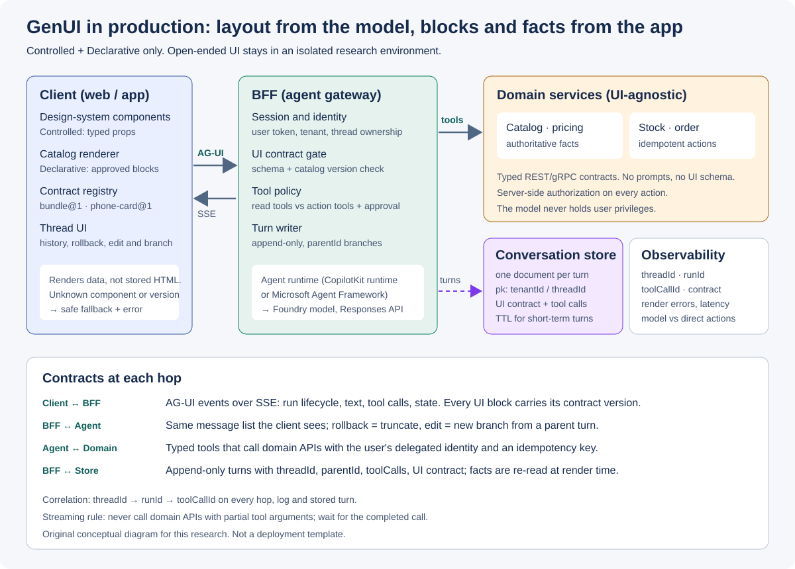

# GenUI 프로덕션 아키텍처 — 대화 기록, 롤백, BFF↔BE 프로토콜

**기준일: 2026-09-28.** 앞의 문서들은 Generative UI의 선택지를 넓게 비교했습니다. 이 문서는
**실서비스 운영 완성도**를 기준으로 범위를 좁힙니다. 운영 기본값은 Controlled와 Declarative를
결합한 적응형 UI이며, Open-ended(MCP Apps·Fully Open)는 격리된 연구 환경에 둡니다.

핵심 원칙은 한 줄입니다. **레이아웃은 모델이, 블록과 사실은 앱이 책임진다.**

## 질문

GenUI를 챗봇 서비스에 넣으면 개념 증명 단계에서는 드러나지 않던 운영 과제가 생깁니다.

1. 모델이 만든 UI가 포함된 대화를 어떻게 보관하고, 다시 열었을 때 어떻게 복원하는가?
2. 사용자가 이전 질문으로 돌아가 고치면 모델 맥락과 이미 그려진 UI, 이미 실행된 업무는 어떻게 되는가?
3. 브라우저·BFF·백엔드 사이에서 무엇을 어떤 계약으로 주고받아야 하는가?

이 문서의 답은 Contoso 디바이스 컨시어지 데모를 Azure에 배포해 관찰한 결과(아래 “샘플로 확인한
운영 교훈”)와 공식 문서를 근거로 합니다. 실사용 트래픽 측정은 아닙니다.

## 운영 기본값: Controlled × Declarative 적응형 UI

| 결정 | 모델에 맡기는 것 | 앱이 소유하는 것 |
|---|---|---|
| **Controlled** | 어떤 컴포넌트를, 어떤 ID·옵션으로 보여 줄지 | 화면 구조, 디자인 시스템, 접근성, 가격·재고 |
| **Declarative** | 승인된 블록의 조합과 배치 | 블록 구현, 카탈로그 버전, 블록 안의 사실과 계산 |
| Open-ended (운영 제외) | HTML·코드 전체 | 샌드박스 경계만 |

적응(Adaptation)은 두 방식을 섞는 방법입니다. Declarative 카탈로그의 블록 하나하나를
**Controlled 컴포넌트로 구현**하면, 모델이 화면 조합을 바꾸더라도 블록 단위의 품질·접근성·브랜드는
기존 디자인 시스템이 보장합니다. 데모의 `ProductTile`과 `BundleSummary`가 이 형태입니다. 두 블록은
제품 ID만 받고 가격과 합계는 스스로 조회·계산하므로, 카탈로그 정의에는 가격 속성이 아예 없습니다.

도입은 한 번에 넘어가지 않습니다.

1. **Controlled 기준선**: 자주 쓰는 업무 화면을 컴포넌트 도구로 등록합니다. 모델은 선택만 합니다.
2. **Declarative 조합 도입**: 요청마다 조합이 달라져야 가치가 생기는 화면만 카탈로그로 엽니다.
   카탈로그의 블록은 1단계 컴포넌트를 재사용합니다.
3. **카탈로그 확장**: 계약 버전을 올리며 블록을 늘립니다. 새 블록은 이전 버전 스레드의 재렌더링을
   깨지 않아야 합니다.

## 참조 아키텍처



*그림 6. 이 리서치의 설계 제안. 배포 템플릿이 아니며, 각 상자의 제품 선택은 조직 표준에 맞춰 바꿀 수 있다.*

| 계층 | 책임 | 하지 않는 일 |
|---|---|---|
| 클라이언트 | 승인된 컴포넌트·카탈로그 렌더링, 계약 버전 확인, 스레드 UI | 저장된 HTML 실행, 가격 계산 |
| BFF(에이전트 게이트웨이) | 세션·신원, UI 계약 검증, 도구 정책, 턴 기록, 에이전트 실행 | 도메인 규칙 소유 |
| 에이전트 런타임 | 의도 해석, 도구 선택, UI 도구 호출 | 사용자 권한 보유 |
| 도메인 서비스 | 가격·재고·주문의 권위 있는 사실과 실행 | UI 스키마·프롬프트 인지 |
| 대화 저장소 | 턴 단위 기록, 분기, 보존 기간 | 렌더링 결과 저장 |

BFF에는 CopilotKit 런타임이나 Microsoft Agent Framework의 AG-UI 엔드포인트를 둘 수 있습니다.
[Agent Framework의 AG-UI 통합][maf-agui]은 에이전트 응답을 AG-UI 이벤트로 변환하고, 텍스트·도구·
승인·상태 이벤트를 어떻게 렌더링할지는 클라이언트가 결정한다고 설명합니다. 언어별 SDK의 지원
범위가 다르다는 점도 같은 문서에 있습니다.

## 1. GenUI 대화 기록 보관

### 저장 대상은 렌더링 결과가 아니라 UI를 만든 데이터

모델이 만든 화면을 HTML이나 스크린샷으로 저장하면 다시 열 때 실행 위험, 접근성, 브랜드 변경,
오래된 가격 문제가 한꺼번에 생깁니다. 저장해야 할 것은 **UI를 만든 입력**입니다.

| 필드 | 예 | 목적 |
|---|---|---|
| 메시지와 역할 | 사용자 질문, 어시스턴트 응답 | 모델 맥락 재구성 |
| UI 도구 호출 | `show_phone_comparison`, 인자 `{ productIds }` | Controlled 재렌더링 |
| A2UI 연산 | `createSurface`, `updateComponents`, `updateDataModel` | Declarative 재렌더링 |
| UI 계약 버전 | `contoso-home-bundle@1` | 호환성 판단 |
| 상관관계 ID | `threadId`, `runId`, `toolCallId` | 추적·감사 |
| 부모 턴 ID | 편집 이전 턴 | 분기(롤백) |

### 데이터 모델: 턴 단위 문서

[Azure Cosmos DB의 Agent memories 문서][cosmos-memory]는 채팅 기록과 에이전트 기억 저장에
**턴 하나를 문서 하나로 저장하는 모델**을 권장합니다. 파티션 키는 대화 중심 앱이면 `threadId`,
멀티테넌트 서비스면 `[tenantId, threadId]` 계층형 키를 예로 듭니다. 단기 기억은 TTL로
만료시킬 수 있다고 설명합니다.

GenUI에서는 여기에 UI 필드를 더합니다.

```json
{
  "id": "turn-0007",
  "tenantId": "kr-retail",
  "threadId": "thread-8f2c",
  "parentTurnId": "turn-0006",
  "branch": "main",
  "userMessage": "4인 가족 번들 구성해 줘",
  "assistantMessages": ["…"],
  "uiCalls": [
    {
      "toolCallId": "call_91",
      "tool": "render_a2ui",
      "contract": "contoso-home-bundle@1",
      "a2uiOps": ["createSurface", "updateComponents", "updateDataModel"]
    }
  ],
  "factsPolicy": "reload",
  "createdAt": "2026-09-28T07:12:00Z"
}
```

위 스키마는 제안이며 특정 제품의 필수 형식이 아닙니다.

### 다시 열었을 때의 정책

| 상황 | 권장 동작 |
|---|---|
| 비교·추천 카드 | 저장된 ID로 **사실을 재조회**해 현재 가격·재고로 렌더링하고 “현재 기준” 표시 |
| 주문·예약 확인서 | 당시 확정 값을 도메인 서비스의 **확정 기록**에서 읽어 표시(대화 저장소에 복사하지 않음) |
| 계약 버전이 같음 | 그대로 재렌더링 |
| 계약 버전이 바뀜 | 호환되면 변환, 아니면 읽기 전용 요약과 “이 화면은 이전 버전” 안내 |
| 알 수 없는 컴포넌트 | 조용히 빼지 않고 오류 블록과 원문 텍스트를 표시 |

가격을 대화 기록에 복사하지 않는 이유는 두 가지입니다. 다시 열었을 때 틀린 값을 보여 주지 않고,
개인정보·상거래 데이터의 보존 범위를 줄입니다.

## 2. 이전 맥락 롤백·편집

### 모델 맥락은 전송된 메시지 목록이 결정한다

데모의 CopilotKit 런타임은 실행 요청마다 클라이언트가 가진 메시지 목록을 보냅니다. 따라서
**목록을 되돌리면 모델 맥락도 되돌아갑니다.** 데모의 “이 턴 이전으로”는 해당 사용자 메시지부터
뒤를 잘라 내고, “수정”은 잘라 낸 지점에 고친 질문을 넣어 다시 실행합니다. 실행 요청을 기록해 보면
첫 질문은 메시지 1개, 두 번째 질문은 앞선 응답과 도구 결과를 포함한 6개였고, 첫 질문을 수정해
다시 실행하자 다시 1개로 줄었습니다. 서버가 대화를 따로 보관하는 런타임을 쓴다면 같은 원칙을
서버 측 분기 포인터로 구현해야 합니다.

운영에서는 잘라 내기 대신 **분기**로 저장합니다.

- 새 질문은 `parentTurnId`를 가진 새 턴으로 기록하고, 스레드의 활성 분기 포인터만 옮깁니다.
- 이전 분기는 삭제하지 않습니다. 감사와 “이전 답변 보기”를 위해 남기고 보존 기간 정책을 따릅니다.
- 모델에 보내는 목록은 활성 분기의 루트부터 현재 턴까지입니다.

### 롤백은 대화를 되돌리지, 업무를 되돌리지 않는다

| 이전 턴에서 일어난 일 | 롤백 후 처리 |
|---|---|
| 조회만 함(비교, 번들 구성) | 안전하게 다시 실행 가능 |
| 장바구니·예약 가확정 | 도메인 서비스의 취소 API로 명시적 보상, 사용자에게 알림 |
| 결제·주문 확정 | 대화에서 되돌리지 않음. 해당 턴을 “되돌릴 수 없는 액션”으로 잠금 |

같은 액션이 롤백·재시도로 다시 호출될 수 있으므로 모든 쓰기 도구에는 **멱등성 키**를 요구합니다.
키는 `threadId`와 `toolCallId`처럼 재실행에도 바뀌지 않는 값에서 만듭니다.

### UI 상태와 모델 맥락의 불일치

사용자가 UI에서 필터를 바꾸거나 슬라이더를 움직이면 화면 상태는 바뀌지만 모델은 모릅니다.
이 값이 다음 질문의 전제라면 BFF가 **명시적 컨텍스트 이벤트**로 기록해야 합니다. 그렇지 않으면
“아까 고른 제품으로” 같은 후속 질문이 엉뚱한 제품을 가리킵니다.

## 3. BFF ↔ BE 프로토콜

### 세 홉을 서로 다른 계약으로 분리한다

| 홉 | 권장 계약 | 담는 것 | 담지 않는 것 |
|---|---|---|---|
| 클라이언트 ↔ BFF | [AG-UI 이벤트][agui-events] over SSE | 실행 수명주기, 텍스트, 도구 호출, 상태, UI 계약 버전 | 도메인 원시 데이터 전체 |
| BFF ↔ 에이전트 | AG-UI 또는 같은 프로세스 호출 | 활성 분기의 메시지, 허용 도구 목록 | 사용자 자격 증명 |
| 에이전트/BFF ↔ 도메인 | 타입이 있는 REST/gRPC | 조회·실행 요청, 위임된 사용자 신원, 멱등성 키 | 프롬프트, UI 스키마 |

**도메인 API는 UI를 모르게 둡니다.** UI 계약과 도메인 응답의 매핑은 BFF와 클라이언트 컴포넌트가
맡습니다. 그래야 화면을 바꾸거나 Declarative 블록을 늘려도 백엔드 배포가 따라 움직이지 않습니다.

### 계약에 반드시 넣을 것

- **상관관계**: 모든 홉과 로그, 저장된 턴에 `threadId → runId → toolCallId`를 전달합니다.
- **UI 계약 버전**: Controlled 컴포넌트와 카탈로그마다 버전을 붙이고 BFF가 지원 목록과 대조합니다.
  A2UI는 `catalogId`로 카탈로그 계약을 식별합니다([A2UI v0.9.1][a2ui-spec]).
- **오류 모델**: 재시도 가능 여부, 사용자에게 보일 메시지, 내부 원인을 분리합니다.
- **도구 등급**: 조회 도구와 실행 도구를 나누고, 실행 도구는 확인 단계와 서버 권한 검사를 거칩니다.
- **신원**: 모델은 권한을 갖지 않습니다. BFF가 사용자 세션을 도메인 호출에 위임하고, 서버는 액션마다
  권한을 검사합니다. 데모의 모델 호출도 API 키 없이 관리 ID와 Microsoft Entra ID 토큰을 씁니다
  ([Configure keyless authentication][keyless]).

### 모델 제약도 프로토콜 결정에 들어간다

[Foundry Models sold by Azure][models]는 GPT-5.6이 Chat Completions와 function tools를
`reasoning_effort`가 `none`일 때만 함께 지원하므로 도구 호출에는 Responses API를 쓰라고 안내합니다.
GenUI의 UI 표시는 도구 호출이므로, 데모에서는 에이전트와 모델 사이를 Responses API로 고정했습니다.

## 샘플로 확인한 운영 교훈

2026-09-28 koreacentral 배포에서 GPT-5.6 Luna·Terra로 데모를 실행하며 관찰하고 고친 문제입니다.
관찰 사례이며 일반적인 발생 빈도를 뜻하지 않습니다.

| 관찰 | 원인 | 조치 |
|---|---|---|
| 새로고침 후 화면 복원 | 메시지와 도구 호출을 데이터로 저장했기 때문에 Controlled 카드와 A2UI 번들이 모두 재렌더링 | 렌더링 결과 대신 UI를 만든 데이터를 저장 |
| 카탈로그 API 404가 간헐적으로 발생 | 도구 인자가 스트리밍되는 동안 컴포넌트가 `x-ul` 같은 미완성 ID로 먼저 렌더링 | ID가 안정될 때까지 조회 지연, 최종 인자로 재조회 |
| 비교 카드가 두 번 그려짐 | 컴포넌트 도구 뒤의 후속 실행에서 모델이 같은 도구를 재호출 | Controlled 도구는 후속 실행 끔 |
| 같은 프롬프트에 한 모델만 카드를 그리지 않음 | “먼저 한 문장을 쓰라”는 지시를 문장만으로 답해도 된다고 해석 | “카드가 곧 답”으로 지시 명확화, 모델별 회귀 테스트 |
| 보조 텍스트가 거의 보이지 않음 | 앱 CSS 변수 이름이 GenUI 라이브러리 변수와 충돌 | 앱 변수에 접두사 부여 |
| 파트너 앱 서버 리비전이 Unhealthy | Host 헤더 검증이 헬스 probe까지 막음 | 헬스 경로를 Host 검증 앞으로 이동 |

첫 두 항목은 문서의 원칙을 실제로 확인한 사례입니다. **부분 인자로 부작용을 일으키지 말 것**,
그리고 **Controlled 경로는 결정적으로 만들 것**. 모델을 바꾸면 같은 프롬프트의 UI 선택이 달라질 수
있으므로, 운영에서는 모델 교체마다 UI 도구 선택을 회귀 테스트로 확인해야 합니다.

## 데모에서 확인할 수 있는 것

[Contoso 디바이스 컨시어지 샘플][sample]은 이 문서의 기준에 맞춰 화면을 재구성했습니다.

- 상단: Controlled와 Declarative × Controlled 블록(운영 권장 경로)
- 중단: UI가 포함된 대화의 저장·복원, 턴 되돌리기, 이전 질문 수정 후 재실행
- 하단(접힘): MCP Apps와 Fully Open(연구 영역)

데모의 기록은 브라우저 저장소에 두어 구조만 보여 줍니다. 운영에서는 BFF가 같은 스냅샷을 사용자·
스레드별로 서버에 저장하고, 위의 분기·보존 정책을 적용해야 합니다.

## 한계와 다음 과제

- 분기 저장, 멱등성 키, 보상 처리는 설계 제안이며 데모에 서버 구현은 없습니다.
- 계약 버전 변환기와 호환 매트릭스는 카탈로그가 두 개 이상의 버전을 가질 때 구체화해야 합니다.
- 다음 단계로 BFF를 Microsoft Agent Framework AG-UI 엔드포인트로 바꾸고, 대화 저장소를 붙인
  서버 측 스레드 복원을 PoC로 검증할 수 있습니다.

## 공식 출처

- [Agent memories in Azure Cosmos DB for NoSQL][cosmos-memory]: 턴 단위 문서 모델, 파티션 키, TTL.
- [AG-UI Integration with Agent Framework][maf-agui]: 이벤트 변환과 렌더링 책임, 언어별 지원 차이.
- [Configure keyless authentication with Microsoft Entra ID][keyless]: 키 없는 모델 호출과 역할.
- [Foundry Models sold by Azure][models]: GPT-5.6의 도구 호출과 Responses API.
- [AG-UI Events][agui-events]: 실행 수명주기와 이벤트 종류.
- [A2UI v0.9.1][a2ui-spec]: 카탈로그 식별과 선언적 UI 연산.
- [CopilotKit Generative UI][ck-genui]: Controlled·Declarative·Open-ended 분류와 API.

[cosmos-memory]: https://learn.microsoft.com/azure/cosmos-db/gen-ai/agentic-memories
[maf-agui]: https://learn.microsoft.com/agent-framework/integrations/by-component/ui/ag-ui/
[keyless]: https://learn.microsoft.com/azure/foundry/foundry-models/how-to/configure-entra-id
[models]: https://learn.microsoft.com/azure/foundry/foundry-models/concepts/models-sold-directly-by-azure
[agui-events]: https://docs.ag-ui.com/concepts/events
[a2ui-spec]: https://a2ui.org/specification/v0.9.1-a2ui/
[ck-genui]: https://docs.copilotkit.ai/concepts/generative-ui-overview
[sample]: https://github.com/daeungo1/devguidesample/tree/feature/genui-concierge-demo/docs/services/application-development/agentic-app-genui/samples/genui-concierge
