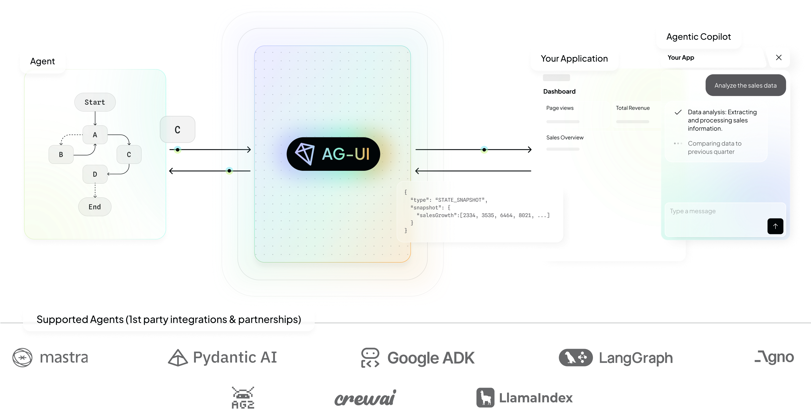
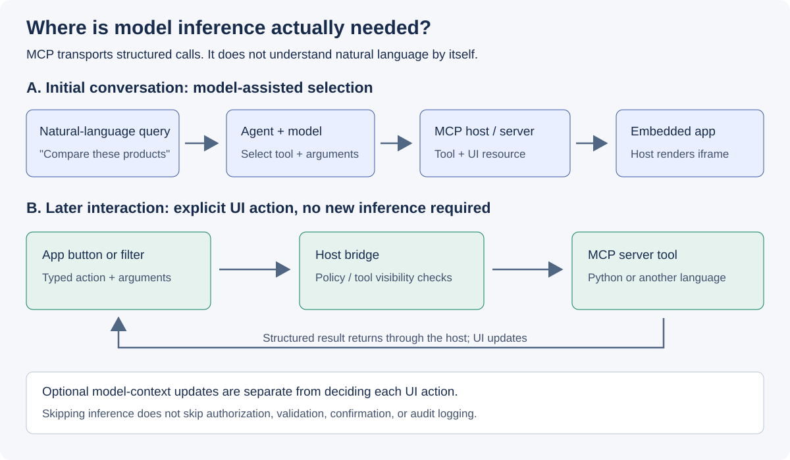

# CopilotKit·AG-UI·MCP Apps의 책임과 호출 경로

**기준일: 2026-09-21.** CopilotKit는 구현 도구이며, AG-UI와 MCP는 서로
다른 상호작용 계약이다. MCP Apps는 MCP 도구에 연결된 UI와 호스트의
상호작용을 다룬다. 이 구분이 있어야 UI 전환 비용과 모델 호출 비용을
독립적으로 설계할 수 있다.

## 질문

“자연어 질의가 Python을 거쳐 MCP 도구를 호출하고 UI를 만든다”는 설명에서
자연어 해석, 도구 선택, 실행, UI 표시 중 어느 단계가 모델을 필요로 하는가?
프로토콜 이름만으로 이 실행 정책이 결정되지는 않는다.

## CopilotKit와 AG-UI

{ style="background-color: white;" }

*원천 도식 P1. AG-UI 프로젝트, [공식 Overview][agui-overview].
[MIT](../licenses/ag-ui-MIT.txt), 변경 없이 수록.
도식의 프로젝트·로고는 원문에 나타난 생태계 관계이며, 모든 조합의 호환성이나
개별 기능 지원을 검증한 인증표가 아니다.*

[로컬 원본 확대](../images/ag-ui-overview-original.png)

[CopilotKit][copilotkit]는 에이전트와 연결되는 프런트엔드·런타임을 구성하기
위한 스택이다. [공식 AG-UI 설명][agui]에 따르면 AG-UI를 통해 지원하는
에이전트 프레임워크와 앱 사이의 연결을 추상화한다.

AG-UI가 다루는 것은 단순한 답변 텍스트가 아니다.

- 에이전트 메시지의 실시간 전달
- 프런트엔드 도구 호출과 사용자 상호작용
- 에이전트와 클라이언트 사이의 공유 상태
- 도구 실행·승인 등을 UI에 연결하는 이벤트

이 통신 경계가 분리되면 백엔드 변경에 대한 UI의 결합도를 줄일 수 있다.
그러나 이벤트를 실제로 어떤 화면으로 렌더링할지, 어떤 상태를 공유할지,
누가 도구를 승인할지는 구현과 정책으로 남는다.

### 이벤트를 화면 상태와 연결

[AG-UI Events][agui-events]는 실행 수명주기와 텍스트·도구·상태 등의
이벤트를 구분한다. 클라이언트는 도착한 문자열만 붙이는 대신 이벤트의
의미에 맞춰 로딩·진행·실패·승인 대기 상태를 표현해야 한다.

실행 수명주기의 시작은 `RunStarted`, 종료는 `RunFinished` 또는
`RunError`로 설명된다. 특히 최신 이벤트 문서의 `RunFinished`에는
`outcome.type: "interrupt"`인 사용자 입력 대기도 포함될 수 있다.
따라서 이벤트 이름만 보고 모든 업무가 성공했다고 표시하지 않고,
선택한 SDK 버전의 outcome과 업무 응답을 함께 확인해야 한다.

이는 승인 UI와 최종 업무 상태를 분리해야 하는 구체적인 이유다. 실행
종료와 예약·주문 확정은 같은 의미가 아니며, thread·run·도구 호출의
상관관계를 유지해야 재연결과 늦은 응답을 처리할 수 있다.

### 프레임워크 어댑터와 UI renderer는 다르다

[Microsoft Agent Framework의 공식 통합 문서][learn-agui]는 에이전트 응답을
AG-UI 이벤트로 바꾸는 어댑터와 클라이언트의 렌더링을 분리한다. 같은 문서가
언어별 SDK 지원 차이도 명시한다.

따라서 “AG-UI endpoint에 연결된다”는 사실만으로 다음을 결론 내리지 않는다.

- A2UI의 특정 버전과 모든 카탈로그를 렌더링할 수 있다.
- MCP Apps의 iframe·리소스·도구 요청을 호스트가 처리한다.
- 모든 backend에서 승인·상태·취소가 동일하게 동작한다.

## MCP와 MCP Apps

[MCP Apps 공식 개요][mcp-apps]는 일반 MCP 도구 응답의 텍스트·이미지·리소스·
구조화 데이터와, 도구에 연결된 상호작용 UI를 구분한다.

MCP Apps의 주요 연결 지점은 다음과 같다.

| 요소 | 역할 |
|---|---|
| 도구 설명의 `_meta.ui.resourceUri` | 연결된 `ui://` UI 리소스를 가리킴 |
| UI 리소스 | HTML과 필요한 자산으로 구성한 앱의 표현 |
| 지원 호스트 | 리소스 조회, 표시, 앱과 도구 사이의 요청 중개 |
| 웹 호스트의 sandboxed iframe | 호스트 화면과 앱의 실행 경계를 분리 |
| JSON-RPC 기반 앱·호스트 통신 | 도구 호출, UI 초기화, 컨텍스트 갱신 등 |
| CSP·권한 설정 | 외부 자원과 추가 기능 사용 범위를 제한 |

도구 결과는 데이터이고 UI 리소스는 그 결과를 표시·조작할 앱일 수 있다.
도구를 호출할 때마다 새로운 UI 코드를 생성해야 하는 것은 아니다. 지원
호스트는 도구 설명을 통해 UI 리소스를 미리 가져오는 경로도 가질 수 있다.

격리는 위험을 줄이는 경계다. 서버 측 업무 권한, 개인정보 처리, 결과의
정확성까지 자동으로 해결하는 보증으로 표현하지 않는다.

## 두 호출 경로를 분리해서 본다



*그림 3. MCP Apps 공식 개요의 도구·UI 상호작용을 바탕으로 직접 작성한
개념도. 직접 호출도 호스트 정책과 서버 권한 검사 안에서 실행한다.*

### A. 자연어에서 시작하는 에이전트 경로

1. 사용자가 “조건에 맞는 제품을 비교해 줘”라고 요청한다.
2. 에이전트가 요청을 해석하고 도구와 인자를 선택한다. 이 단계에 LLM을
   사용한다면 모델 호출 비용과 지연이 발생한다.
3. 호스트·런타임이 MCP 서버의 도구를 호출한다.
4. 도구의 데이터와 연결된 UI 리소스를 이용해 호스트가 앱을 표시한다.
5. 사용자는 결과를 읽거나 앱에서 다음 액션을 수행한다.

규칙 기반 파서로 2번을 구현할 수도 있지만, 이는 애플리케이션이 지원하는
제한된 입력 범위의 설계 선택이다. MCP 자체가 임의의 자연어를 해석하지 않는다.

### B. 화면 조작에서 시작하는 명시적 액션 경로

1. 사용자가 필터를 변경하거나 “다음 페이지” 버튼을 누른다.
2. 앱이 도구 이름과 구조화된 인자를 가진 호출을 호스트에 요청한다.
3. 호스트가 허용된 요청을 MCP 서버에 전달한다.
4. 결과가 돌아오면 앱이 화면을 갱신한다.
5. 대화 맥락에 반영할 정보가 있다면 별도로 모델 컨텍스트 갱신을 고려한다.

이 경로는 매번 모델에게 “사용자의 클릭이 무슨 뜻인가”를 다시 물을 필요가 없다.
그러나 실제 구현이 모델을 다시 호출하는지 여부는 호스트·워크플로에 달려
있으므로 trace로 확인해야 한다. 가능성과 실측 성능을 구분한다.

## Python에 대한 정정

Python은 에이전트나 MCP 서버의 구현 언어로 선택할 수 있다. 그러나 다음
등식은 성립하지 않는다.

```text
MCP 사용 = 자연어 해석 생략 = Python 실행 = LLM 호출 없음
```

언어, 호출 프로토콜, 의사결정 정책은 서로 다른 축이다. 특히
[Microsoft Agent Framework와 CopilotKit의 MCP Apps 연동 설명][learn-mcp]은
다음 경계를 명시한다.

```text
Frontend
  -> CopilotKit runtime / Node.js proxy + MCPAppsMiddleware
  -> standard AG-UI request
  -> Python Agent Framework endpoint
```

이 **특정 통합 구조**에서 MCP 도구 발견, iframe 리소스 요청 중개와 UI
리소스 해석은 TypeScript 미들웨어가 처리한다. Python endpoint는 일반 AG-UI
요청을 받으며 MCP Apps 전용 설정이 필요하지 않다는 설명이다.

따라서 “MCP Apps가 Python에서 LLM을 자동 우회한다”는 해석은 부정확하다.
반대로 모든 MCP Apps 구현에 이 Node.js 미들웨어가 반드시 필요하다는
뜻도 아니다. 선택한 호스트·런타임의 구현 경계로만 읽어야 한다.

## 구현할 때 구분할 상태

다음은 프로토콜의 자동 보장 목록이 아니라 통합 테스트 항목이다.

| 상황 | 확인할 계약 |
|---|---|
| 도구 인자가 여러 조각으로 전달됨 | 완성 전에는 부작용 있는 도구 실행 금지 |
| UI는 표시됐지만 도구는 실행 중 | 로딩·취소·실패·완료를 구분 |
| 사용자 승인 거절 | 실행하지 않고 명시적인 거절 상태 반환 |
| 이전 실행 응답이 늦게 도착 | 실행·도구·화면 식별자로 현재 상태와 구분 |
| UI 리소스 지원이 없는 호스트 | 지원 여부를 확인하고 텍스트·기존 화면 경로 제공 |
| 직접 도구 호출 | 모델을 거치지 않아도 권한·입력 검증 수행 |
| 연결 종료 후 재개 | 이벤트 전달과 업무 재실행을 구분하고 중복 쓰기 방지 |

## Best practice와 피할 설계

| 권고 | 이유 | 피할 설계 |
|---|---|---|
| 도구 실행과 UI 렌더링을 분리 | 재사용과 오류 구분이 쉬움 | HTML 안에 업무 권한·정책을 숨김 |
| 직접 액션 경로를 별도 관측 | 추론 횟수와 지연의 원인을 구분 | 모든 버튼을 다시 자연어로 변환 |
| 프로토콜·미들웨어·SDK 버전 기록 | 기능 지원 범위가 서로 다름 | “AG-UI 지원”만으로 전체 호환 선언 |
| 앱용 도구 접근을 최소화 | 화면이 의도하지 않은 작업에 접근하지 않게 함 | iframe 격리만으로 충분하다고 판단 |
| 사용자 승인과 서버 권한을 모두 검증 | 확인 UI는 인증·인가가 아님 | 버튼 클릭만으로 임의 도구 실행 |
| 실패를 사용자와 로그에 표시 | 원인별 복구와 운영 진단 가능 | UI 리소스 실패를 빈 카드로 숨김 |

MCP Apps가 더 나은 선택인지도 따져야 한다. 호스트의 대화 맥락과 도구
연결이 필요하지 않은 독립 서비스라면 일반 웹 앱이 더 단순할 수 있다는
점은 [공식 개요][mcp-apps]도 설명한다.

## 한계와 다음 읽기

공식 문서상의 구조를 조사했으며, 특정 CopilotKit·AG-UI·MCP SDK 조합을
설치해 검증하지 않았다. 라이브러리의 함수 시그니처를 복사한 실행 예제 대신
책임과 메시지 경로를 제시한다.

UI 표현 자체의 계약은 [A2UI 분석](../google-a2ui/index.md), 도입 순서와
측정 기준은 [적용·평가 계획](../adoption/index.md)을 참고한다.

## 공식 출처

- [CopilotKit 저장소][copilotkit]: 구현 스택과 예제의 공식 진입점.
- [CopilotKit AG-UI][agui]: 이벤트·상태·프런트엔드 도구 연결.
- [AG-UI Overview][agui-overview]와 [Events][agui-events]: 공식 개요 도식과 실행 수명주기.
- [MCP Apps][mcp-apps]: UI 리소스 metadata, 호스트 흐름, 격리와 용도.
- [Microsoft Agent Framework AG-UI][learn-agui]: 런타임 어댑터와 언어별 지원 범위.
- [MCP Apps Compatibility with AG-UI][learn-mcp]: Python endpoint와
  TypeScript 미들웨어의 구체적인 책임 경계.

[copilotkit]: https://github.com/CopilotKit/CopilotKit
[agui]: https://docs.copilotkit.ai/agentic-protocols/ag-ui
[mcp-apps]: https://modelcontextprotocol.io/extensions/apps/overview
[learn-agui]: https://learn.microsoft.com/agent-framework/integrations/by-component/ui/ag-ui/
[learn-mcp]: https://learn.microsoft.com/agent-framework/integrations/by-component/ui/ag-ui/mcp-apps
[agui-overview]: https://docs.ag-ui.com/introduction
[agui-events]: https://docs.ag-ui.com/concepts/events
