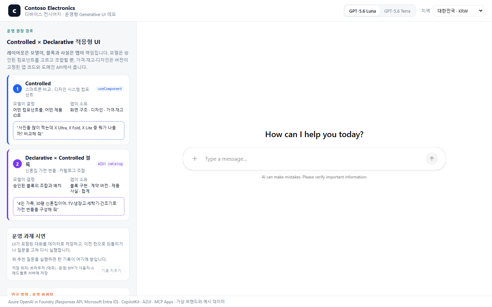
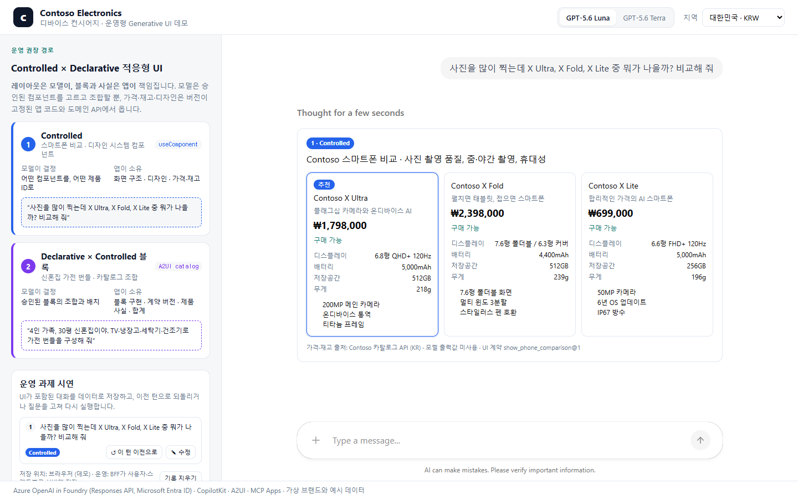
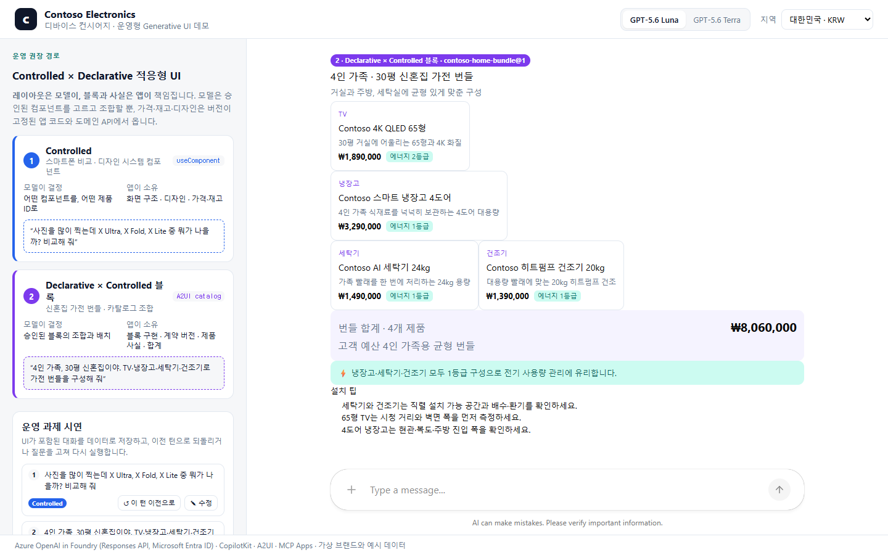
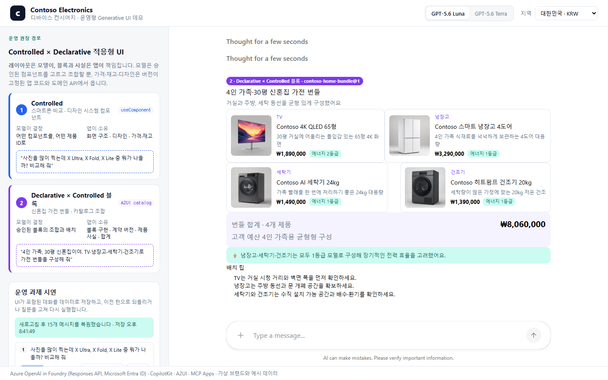
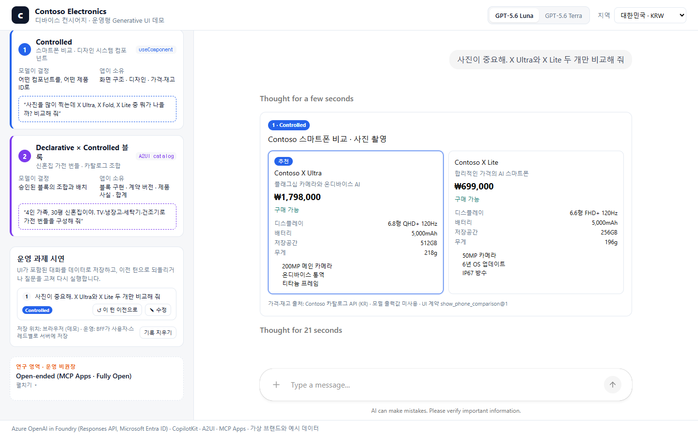
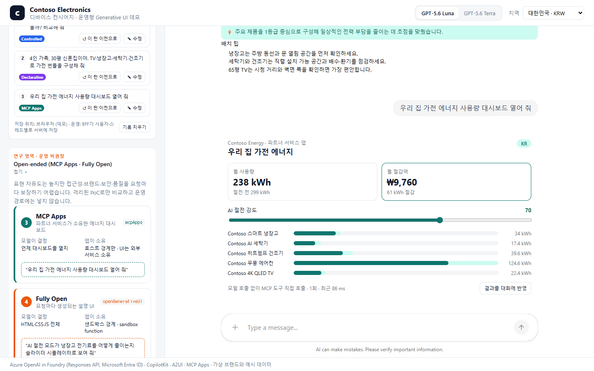
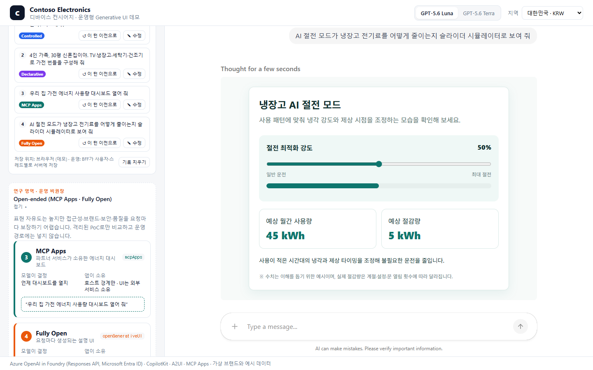
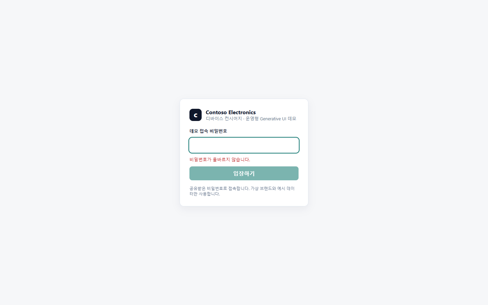

# Contoso 디바이스 컨시어지 — 운영형 Generative UI 데모

글로벌 스마트폰·가전 브랜드의 B2C 에이전트에 **Controlled × Declarative 적응형 UI**를 적용하고,
GenUI 챗봇을 운영할 때의 과제인 **UI가 포함된 대화 기록 보관, 이전 턴 롤백, 질문 수정 후 재실행**을
시연하는 CopilotKit 데모입니다. Azure OpenAI in Microsoft Foundry의 **GPT-5.6 Luna / Terra**를
API 키 없이 Microsoft Entra ID로 호출합니다.

브랜드(Contoso Electronics), 제품, 가격, 전력 사용량은 모두 가상의 예시 데이터입니다.
제품 이미지는 실제 제품 사진이 아니라 Microsoft Foundry의 `gpt-image-2`로 **로고·문자·상표 없이 생성한
가상 제품 렌더링**이며 `web/public/products/`에 정적 자산으로 들어 있습니다. 이미지 경로는 카탈로그
API가 제품 ID로 내려주므로, 모델이 이미지 URL을 만들지 않습니다.
설계 배경은 주제 문서의 [프로덕션 아키텍처](../../production/index.md)를 참고하세요.



## 화면 구성

| 위치 | 내용 | 의도 |
|---|---|---|
| 왼쪽 위 · **운영 권장 경로** | 1 Controlled, 2 Declarative × Controlled 블록 | 레이아웃은 모델이, 블록과 사실은 앱이 |
| 왼쪽 가운데 · **운영 과제 시연** | 대화·UI 저장과 복원, 턴 되돌리기, 질문 수정 후 재실행 | 챗봇 운영에서 먼저 부딪히는 문제를 직접 확인 |
| 왼쪽 아래 · **연구 영역(접힘)** | 3 MCP Apps, 4 Fully Open | 운영 경로에서 분리한 비교용 실험 |

| 1 Controlled | 2 Declarative × Controlled 블록 |
|---|---|
|  |  |
| **새로고침 후 복원** | **이전 질문 수정 후 재실행** |
|  |  |

## 운영 권장 경로 — Controlled × Declarative 적응

| 단계 | 시나리오 | 모델이 결정하는 것 | 앱이 소유하는 것 | CopilotKit API |
|---|---|---|---|---|
| 1 Controlled | 스마트폰 3종 비교 | 어떤 컴포넌트를, 어떤 제품 ID로 | 화면 구조, 디자인, 가격·재고 | `useComponent` |
| 2 Declarative × Controlled 블록 | 신혼집 가전 번들 | 승인된 블록의 조합·배치 | 블록 구현, 계약 버전, 제품 사실, 합계 | A2UI 카탈로그 (`a2ui={{ catalog }}`) |

2단계의 카탈로그 블록(`ProductTile`, `BundleSummary`)은 그 자체가 Controlled 컴포넌트입니다.
모델이 배치를 바꿔도 블록 안의 품질·접근성·가격 계산은 앱 코드가 보장합니다. 두 컴포넌트에는
UI 계약 버전(`show_phone_comparison@1`, `contoso-home-bundle@1`)이 표시됩니다.

## 운영 과제 시연

| 기능 | 동작 | 구현 |
|---|---|---|
| 대화·UI 저장 | 실행이 끝날 때마다 메시지와 도구 호출을 **UI 계약 버전과 함께** 스냅샷으로 저장 | `web/src/lib/thread-store.ts` |
| 새로고침 복원 | 저장된 메시지를 에이전트에 다시 넣으면 CopilotKit이 카드와 번들을 데이터로부터 재렌더링. 계약 버전이 바뀌었으면 경고 | `ConversationPanel` |
| 턴 되돌리기 | 선택한 사용자 메시지부터 뒤를 잘라 모델 맥락을 그 시점으로 되돌림 | `rollbackBefore()` |
| 질문 수정 | 되돌린 지점에 고친 질문을 넣고 다시 실행 | `agent.setMessages` + `runAgent` |

데모는 브라우저 `localStorage`에 저장합니다. 운영에서는 BFF가 같은 스냅샷을 사용자·스레드별로
서버에 저장하고, 잘라 내기 대신 분기로 기록해야 합니다. 저장 위치, 분기 모델, 롤백과 업무 실행의
관계는 [프로덕션 아키텍처](../../production/index.md)에 정리했습니다.

## 연구 영역 — Open-ended (운영 비권장)

| 단계 | 시나리오 | 모델이 결정하는 것 | 앱이 소유하는 것 | CopilotKit API |
|---|---|---|---|---|
| 3 MCP Apps | 가전 에너지 대시보드 | 언제 대시보드를 열지 | 파트너 서비스가 UI·계산·도구 소유 | 런타임 `mcpApps` + MCP ext-apps |
| 4 Fully Open | 절전 원리 시뮬레이터 | HTML·CSS·JS 전체 | 샌드박스 경계, sandbox function | 런타임 `openGenerativeUI` |

| 3 MCP Apps | 4 Fully Open |
|---|---|
|  |  |

표현 자유도는 높지만 접근성·브랜드·보안·품질을 요청마다 보장하기 어려워 운영 경로에서 분리했습니다.
3단계에서는 대시보드 슬라이더가 호스트 브리지를 통해 앱 전용 도구 `simulate_savings`
(`_meta.ui.visibility: ["app"]`)를 **모델을 거치지 않고 직접 호출**하는 경로를 확인할 수 있습니다.

### 사실은 모델이 아니라 도메인 API에서

모든 단계에서 가격·재고·전력 수치는 모델 출력이 아니라 앱이 소유한 데이터에서 옵니다.

- Controlled: `PhoneComparison`은 제품 ID만 받고 `/api/catalog`에서 가격·재고·이미지를 조회합니다.
- Declarative: 카탈로그 정의에 가격·통화·재고 속성이 **아예 없습니다**
  (`web/src/a2ui/definitions.test.ts`가 이를 계약으로 검증).
- MCP Apps: 계산은 MCP 서버의 `simulate_savings`가 담당합니다.
- Fully Open: 생성 UI는 `get_catalog_facts` sandbox function으로 호스트에 사실을 요청합니다.

## 아키텍처

```text
Browser ── AG-UI ──► web (Container Apps, external ingress)
                     ├─ /api/copilotkit  CopilotRuntime
                     │    ├─ BuiltInAgent "luna"  → gpt-5.6-luna  ┐ Responses API
                     │    ├─ BuiltInAgent "terra" → gpt-5.6-terra ┘ Entra ID token
                     │    ├─ a2ui · openGenerativeUI
                     │    └─ mcpApps ──► mcp (Container Apps, internal ingress)
                     └─ /api/catalog     Contoso 카탈로그 (지역별 가격)
Managed identity ─► Foundry: Cognitive Services User · ACR: AcrPull
```

| 폴더 | 내용 |
|---|---|
| `web/` | Next.js 15 + CopilotKit 1.73 앱, 런타임, 카탈로그 API |
| `mcp/` | Contoso Energy MCP Apps 서버와 단일 HTML 대시보드 |
| `infra/` | Bicep: Foundry(모델 2개), Container Apps, ACR, 관리 ID, Log Analytics |
| `azure.yaml` | azd 서비스 정의 |

## 참고한 CopilotKit 자료와의 차이

세 패턴의 분류와 데모 화면 구성은 CopilotKit의 [Generative UI showcase][ck-showcase]를 따랐습니다.
이 showcase는 실행 코드 없이 README·이미지·가이드 PDF로 된 개념 자료이므로, 구현은 CopilotKit 1.73의
[Generative UI 문서][ck-genui]와 [MCP Apps showcase 코드][ck-mcp-showcase]를 기준으로 했습니다.

| 패턴 | showcase README의 방식 | 이 데모의 방식 | 이유 |
|---|---|---|---|
| Controlled | `useFrontendTool` + 실행 단계별 `render` | `useComponent`(Components as Tools) + `followUp: false` | 최신 문서의 표시 전용 권장 API, 카드 중복 렌더링 방지 |
| Declarative | ADK(Python) 에이전트 + A2UI **v0.8** 메시지(`surfaceUpdate` 등) + `createA2UIMessageRenderer` | `BuiltInAgent` + A2UI 카탈로그(`createCatalog`, `a2ui={{ catalog }}`) | v0.8은 Legacy, 현재는 v0.9.1. 블록을 Controlled 컴포넌트로 구현 |
| Open-ended | `.use(new MCPAppsMiddleware(...))` | 런타임 `mcpApps` 옵션(같은 미들웨어를 자동 적용) + `openGenerativeUI` | 1.73 런타임 내장 옵션, Fully Open 단계 추가 |
| 모델 | OpenAI 등 공개 모델 | Azure OpenAI GPT-5.6 Luna·Terra, Responses API, Entra ID | Azure 키 없는 운영 구성 |

showcase가 함께 소개하는 Open-JSON-UI는 이 데모에 넣지 않았습니다.

[ck-showcase]: https://github.com/CopilotKit/CopilotKit/tree/main/examples/showcases/generative-ui
[ck-genui]: https://docs.copilotkit.ai/concepts/generative-ui-overview
[ck-mcp-showcase]: https://github.com/CopilotKit/CopilotKit/tree/main/examples/showcases/mcp-apps

## 설계 결정

- **GPT-5.6은 Responses API로 호출합니다.** Microsoft Learn의
  [Foundry Models sold by Azure][models] 문서는 GPT-5.6이 Chat Completions와 function
  tools를 `reasoning_effort`가 `none`일 때만 함께 지원하며, 도구 호출에는 Responses API를
  쓰라고 안내합니다. 네 단계가 모두 도구 호출이므로 `azure.responses(deployment)`를 씁니다.
- **API 키를 쓰지 않습니다.** Foundry 계정은 `disableLocalAuth: true`로 만들고, 앱은
  `https://ai.azure.com/.default` 스코프 토큰으로 호출하며, 관리 ID에 Foundry 리소스 범위의
  **Cognitive Services User** 역할을 부여합니다([Configure keyless authentication][keyless]).
  같은 문서의 권장대로 `DefaultAzureCredential` 대신 Azure에서는 `ManagedIdentityCredential`,
  로컬에서는 `AzureCliCredential`을 명시적으로 선택합니다.
- **MCP 서버는 internal ingress입니다.** internal ingress의 FQDN은 같은 Container Apps
  환경 안에서만 도달할 수 있습니다. 단, 환경 수준 HTTP 라우트의 대상으로 지정하면 외부
  트래픽을 받을 수 있으므로 라우트에 넣지 않습니다([Ingress in Azure Container Apps][ingress]).
  Host 헤더는 `ALLOWED_HOSTS`로 내부 FQDN만 허용해 DNS rebinding을 막습니다.
- **이미지는 관리 ID로 풀링합니다.** 사용자 할당 관리 ID에 ACR `AcrPull`을 부여하고 관리자
  계정은 끕니다([Image pull with managed identity][acrpull]).
- **런타임은 첫 요청 때 만듭니다.** `next build` 중 route 모듈이 평가될 때 배포 환경 값을
  요구하지 않도록 지연 생성합니다.
- **스트리밍 중인 도구 인자로 조회하지 않습니다.** 모델이 인자를 조각으로 보내는 동안
  컴포넌트는 `x-ul` 같은 미완성 ID로 먼저 렌더링됩니다. `useCatalog`는 ID가 350 ms 동안
  바뀌지 않을 때만 조회하고, 최종 ID가 오면 다시 조회합니다.
- **Controlled 컴포넌트는 후속 실행을 끕니다.** `useComponent`의 기본 후속 실행에서 모델이
  같은 도구를 다시 부르면 카드가 두 번 그려질 수 있어 `followUp: false`로 둡니다. 예측 가능성이
  이 단계의 핵심이기 때문입니다.
- **CSS 변수에 접두사를 붙입니다.** CopilotKit 스타일도 `--muted` 같은 이름을 쓰므로, 앱 변수는
  `--cx-*`로 분리해 대비가 무너지지 않게 합니다.
- **MCP 서버의 헬스 체크는 Host 검증 앞에 둡니다.** probe는 Pod IP를 Host로 보내므로 `/healthz`를
  DNS rebinding 검증보다 먼저 처리하지 않으면 리비전이 Unhealthy가 됩니다.

## 접속 비밀번호 게이트 (선택)

외부에 주소를 공유할 때 모델 호출 비용과 무단 사용을 막기 위한 **공유 비밀번호 게이트**입니다.



- `DEMO_PASSWORD` 환경 변수가 있으면 모든 페이지와 API(`/api/copilotkit`, `/api/catalog`)를 보호합니다.
  페이지는 `/login`으로 보내고, API는 401을 반환합니다. 변수가 없으면(로컬 개발) 게이트가 꺼집니다.
- 로그인에 성공하면 비밀번호 원문이 아니라 HMAC으로 만든 세션 토큰을 `HttpOnly · Secure · SameSite=Lax`
  쿠키(7일)에 저장합니다. 비밀번호를 바꾸면 기존 세션은 자동으로 무효가 됩니다.
- 비교는 상수 시간으로 하고, 실패 응답은 약 0.6초 지연해 무차별 대입을 늦춥니다.
- 비밀번호는 저장소에 두지 않고 **Container Apps secret**으로만 주입합니다.

```powershell
# 기존 배포에 설정하거나 비밀번호를 바꿀 때
az containerapp secret set -g <rg> -n <web-app> --secrets "demo-password=<password>"
az containerapp update     -g <rg> -n <web-app> --set-env-vars "DEMO_PASSWORD=secretref:demo-password"

# Bicep으로 배포할 때는 @secure() 파라미터로 넘깁니다 (azd: azd env set DEMO_PASSWORD <password>)
az deployment sub create ... --parameters demoPassword=<password>
```

Bicep을 `demoPassword` 없이 다시 배포하면 secret과 환경 변수가 빠져 게이트가 꺼집니다.
이 게이트는 데모 공유용이며, 사용자별 인증이 필요한 운영 환경에서는 Microsoft Entra ID 같은
ID 공급자 연동으로 대체해야 합니다.

## 로컬 실행

필요 조건: **Node.js 24 LTS**(2028-04-30까지 지원, Node 20은 2026-04-30 EOL), Azure CLI 로그인, 아래 배포로 만든 Foundry 리소스
(배포자에게 Cognitive Services User가 부여됩니다).

```powershell
# 1) MCP 서버
cd mcp
npm ci
npm run build
$env:PORT = "3001"; npm start          # http://127.0.0.1:3001/mcp

# 2) 웹 앱 (다른 터미널)
cd web
npm ci --legacy-peer-deps
$env:AZURE_OPENAI_RESOURCE_NAME = "<foundry-resource-name>"
$env:MCP_SERVER_URL = "http://127.0.0.1:3001/mcp"
npm run dev                             # http://localhost:3000
```

로컬에서는 `127.0.0.1` 바인딩으로 MCP SDK의 DNS rebinding 보호가 자동 적용됩니다.

## Azure 배포

기본 경로는 azd입니다.

```powershell
azd env new genui-concierge --location koreacentral
azd up
```

azd 인증을 쓸 수 없는 환경에서는 같은 Bicep을 Azure CLI로 배포하고 ACR에서 이미지를 빌드합니다.

```powershell
$oid = az ad signed-in-user show --query id -o tsv
az deployment sub create --location koreacentral --template-file infra/main.bicep `
  --parameters environmentName=genui-concierge location=koreacentral principalId=$oid

$acr = "<registry-name>"
az acr build -r $acr -t contoso-energy-mcp:v1   -f mcp/Dockerfile mcp
az acr build -r $acr -t contoso-concierge-web:v1 -f web/Dockerfile web
$loginServer = az acr show -n $acr --query loginServer -o tsv

# 이미지 파라미터를 넘겨 다시 배포하면 컨테이너 앱이 새 이미지로 갱신됩니다.
az deployment sub create --location koreacentral --template-file infra/main.bicep `
  --parameters environmentName=genui-concierge location=koreacentral principalId=$oid `
    webImageName="$loginServer/contoso-concierge-web:v1" mcpImageName="$loginServer/contoso-energy-mcp:v1"
```

Bicep은 GPT-5.6 Luna·Terra를 GlobalStandard, 각 50K TPM으로 배포합니다. 리전·쿼터는
`az cognitiveservices usage list -l <region>`으로 먼저 확인하세요.

## 검증

```powershell
cd mcp; npm test; npm run typecheck     # 13 tests
cd ../web; npm test; npm run typecheck  # 22 tests
```

두 Dockerfile은 Node.js 24 이미지의 빌드 단계에서 같은 테스트를 먼저 실행하므로, 테스트가 실패하면
컨테이너 이미지가 만들어지지 않습니다.

2026-09-28 koreacentral 배포에서 headless Microsoft Edge(1440×900)로 네 단계를 연속 실행한 결과입니다.
각 모델 한 번씩의 수동 실행 기록이며 성능 벤치마크가 아닙니다. 시간은 추천 프롬프트 클릭부터
UI가 완성될 때까지이며, 새 리비전의 첫 요청은 콜드 스타트로 더 오래 걸립니다.

| 단계 | 확인한 동작 | Luna | Terra |
|---|---|---|---|
| Controlled | `show_phone_comparison` 1회 호출, 카탈로그 API 가격으로 카드 1개 렌더링 | 5초 | 9초 |
| Declarative | 헤더 · 2×2 타일 · 합계 · 에너지 노트 · 팁을 모델이 조합, 합계는 앱이 계산 | 8초 | 9초 |
| MCP Apps | 대시보드 렌더링 후 슬라이더가 모델 없이 `simulate_savings` 직접 호출(109–135 ms) | 11초 | 8초 |
| Fully Open | 요청마다 다른 절전 시뮬레이터 HTML 생성, 예시 수치 안내 포함 | 33초 | 39초 |

두 실행 모두 HTTP 4xx·5xx 응답은 없었습니다. 검증 과정에서 같은 프롬프트에 대한 두 모델의
반응 차이도 관찰했습니다. “비교 전에 한 문장을 쓰라”는 지시에 Terra는 문장만 답하고 카드를
그리지 않았습니다. 현재 프롬프트는 “카드가 곧 답”임을 명시해 두 모델 모두 카드를 그립니다.

운영 과제 시연 기능은 같은 날 Luna로 다음 순서를 자동 실행해 확인했습니다.

| 절차 | 기대 | 결과 |
|---|---|---|
| Controlled → Declarative 실행 | 턴 2개, 각각 Controlled·Declarative 태그 | 통과 |
| 페이지 새로고침 | 저장된 15개 메시지 복원, 비교 카드와 번들이 다시 렌더링 | 통과 |
| 2번 턴 되돌리기 | 번들이 사라지고 턴 1개만 남음 | 통과 |
| 1번 질문을 “X Ultra와 X Lite만”으로 수정 | 제품 2개짜리 카드로 다시 실행 | 통과 |
| 실행 요청의 메시지 수 | 1 → 6 → 수정 후 1 | 모델 맥락도 함께 되돌아감을 확인 |
| 연구 영역 | 첫 화면에서 접혀 있음 | 통과 |

## 알려진 제약

- CopilotKit 호스트가 `fullscreen` 표시 모드를 알리지 않으면 대시보드의 전체 화면 버튼은 숨겨집니다.
  대시보드는 호스트 컨텍스트의 `availableDisplayModes`를 읽어, 이를 지원하는 호스트에서만
  `inline`↔`fullscreen` 전환을 제공합니다.
- 브라우저 콘솔에 “allow-scripts와 allow-same-origin을 함께 쓴 iframe” 경고가 나타납니다.
  CopilotKit이 만드는 샌드박스 iframe의 속성이므로, 운영 전 호스트 CSP와 iframe 정책을 검토하세요.
- Fully Open UI는 CDN 스크립트를 불러올 수 있습니다. 운영에서는 허용 출처를 제한해야 합니다.
- 모델 전환 시 새 대화가 시작됩니다. 위 표의 시간은 단일 실행값이며 두 모델의 품질·속도 우열을
  판단할 근거가 아닙니다.
- 장바구니·결제·인증은 범위 밖입니다.

## 비용과 정리

Container Apps(최소 복제본 1), ACR Basic, Log Analytics, 모델 토큰 사용량에 과금됩니다.
데모가 끝나면 리소스 그룹을 삭제하세요.

```powershell
azd down --purge
# 또는
az group delete -n rg-genui-concierge --yes
```

## 다음 단계

- 백엔드 교체: 프런트엔드는 AG-UI만 보므로 `BuiltInAgent`를 Microsoft Agent Framework의
  AG-UI 엔드포인트로 바꿔도 화면 코드는 유지됩니다.
- 같은 MCP 서버를 다른 MCP Apps 호스트에 연결해 호스트 간 재사용을 검증합니다. MCP Apps 공식
  개요는 지원 호스트로 Claude, VS Code GitHub Copilot, Microsoft 365 Copilot 등을 나열하며
  호스트마다 지원 범위가 다르다고 밝힙니다.
- 프로덕션 기준 항목은 주제 문서의 “향후 Demo 및 진행 방향”을 따릅니다.

[models]: https://learn.microsoft.com/azure/foundry/foundry-models/concepts/models-sold-directly-by-azure
[keyless]: https://learn.microsoft.com/azure/foundry/foundry-models/how-to/configure-entra-id
[ingress]: https://learn.microsoft.com/azure/container-apps/ingress-overview
[acrpull]: https://learn.microsoft.com/azure/container-apps/managed-identity-image-pull
