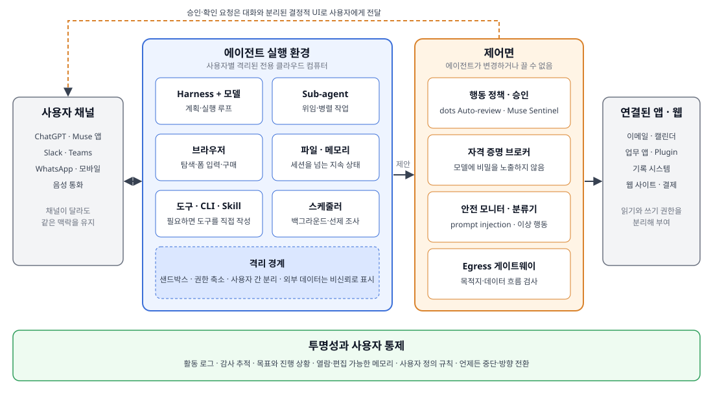

# Frontier Agent 리서치: OpenAI dots와 Meta Muse로 본 CUA의 다음 단계

**조사 기준일: 2026-09-30. CUA 관점 보강: 2026-10-07.** 2026년 9월, OpenAI와
Meta는 거의 같은 시기에 대화형 비서를 넘어서는 개인 에이전트를 공개했다. Meta는
2026-09-08에 [Muse][muse]를, OpenAI는 2026-09-29에 [dots][dots]를 발표했다. 두
제품은 이름과 대상 사용자가 다르지만 구조는 놀라울 만큼 닮았다.

- 사용자마다 **전용 클라우드 컴퓨터와 브라우저**를 준다.
- 사용자가 앱을 닫아도 **백그라운드에서 계속 일하고 먼저 말을 건다**.
- 모델이 무엇을 하든 넘을 수 없는 **분리된 제어면**이 모든 행동을 검사한다.

이 리서치는 두 제품을 “frontier agent”라는 하나의 범주로 묶어 기술 구조를
해부하고, 우리가 Agent 서비스를 준비할 때 무엇을 설계해야 하는지를 정리한다.
OpenAI는 dots를 “frontier intelligence that have your back”이라고 소개하고,
Meta는 Muse를 “move with the frontier”하는 제품이라고 표현한다. 이 문서의
frontier agent는 이런 공개 표현에서 따온 **분석용 용어**이며 두 회사가 정의한
공식 제품 분류가 아니다.

!!! note "이 문서에서 dots와 Muse를 보는 관점"
    두 제품은 화면을 보고 마우스·키보드로 조작하는 **CUA(Computer-Using Agent)
    자체의 모범 사례라기보다**, CUA를 하나의 행동 수단으로 포함하면서 실행 환경,
    상시 실행, 통제 계층까지 갖춘 **상시 동작형 에이전트의 레퍼런스 설계**다.
    두 제품 모두 출시 직후이고 공개 자료는 각 회사의 주장이므로, 검증된
    BP(best practice)가 아니라 설계 방향을 비교하는 기준으로 사용한다.

## 30초 요약

| 질문 | 핵심 판단 |
|---|---|
| frontier agent는 무엇이 다른가 | 한 번의 요청에 답하는 챗봇이 아니라, 목표를 받아 **자기 컴퓨터에서 계속 일하는** 에이전트다. 실행 환경, 상시 실행, 기억, 연결, 제어면, 투명성 여섯 요소를 함께 갖춘다. |
| CUA와의 관계 | CUA가 “화면을 어떻게 조작하는가”의 문제라면, frontier agent는 “어디서, 언제, 어떤 권한으로, 무엇을 막으며 조작하는가”까지 포함한다. 두 제품 모두 **API·connector를 먼저 쓰고 브라우저 조작은 보조 수단**으로 둔다. |
| dots와 Muse의 공통점 | 사용자별 격리된 클라우드 컴퓨터, 선제적 백그라운드 작업, 모델에 비밀을 보여 주지 않는 자격 증명 처리, 에이전트가 끌 수 없는 별도 행동 검사, 활동 기록과 승인 UI. |
| 가장 큰 차이 | dots는 업무 협업(Slack·Teams, specialist dots, Microsoft Agent 365 연동 계획)을, Muse는 개인 생활(WhatsApp, 쇼핑, 일회용 카드)을 우선한다. Meta는 VM 내부 격리 구조를 커널 수준까지 공개했다. |
| 기술적 핵심 | 모델을 믿는 것이 아니라 **모델이 공격받았다고 가정하는 시스템 설계**다. 제안은 에이전트가, 허가는 에이전트 밖의 정책 엔진이 한다. |
| 우리에게 주는 시사점 | Azure에서는 Foundry hosted agent가 격리 실행·세션 상태·에이전트 신원을, Browser Automation과 computer use 도구(모두 preview)가 화면 조작 수단을 제공한다. 하지만 도구 승인의 **집행**과 egress 검사 같은 제어면은 우리가 설계해야 한다. |

## CUA 트렌드에서의 위치

### 관심의 이동: 조작 기술에서 운영 모델로

CUA 모델 자체는 행동을 **제안**할 뿐이다. Microsoft Learn의 [Foundry computer use
도구][computer-use] 문서는 이 구조를 분명히 보여 준다.

- 도구는 기기를 직접 제어하지 않는다. 애플리케이션이 모델이 요청한 행동(클릭,
  입력, 스크롤)을 실행하고, 갱신된 스크린샷을 다시 보내는 루프를 직접 구현한다.
- 민감한 데이터나 중요 리소스에 접근할 수 없는 VM이나 sandbox에서 실행하라고
  경고하며, prompt injection을 포함한 보안·개인정보 위험이 크다고 명시한다.
- 악성 지시, 작업과 무관한 도메인, 민감한 도메인이 감지되면 `pending_safety_checks`를
  반환하고, 애플리케이션은 최종 사용자의 확인을 받은 뒤에만 진행해야 한다.

즉 **실행 환경, 행동 실행, 사용자 승인은 모두 애플리케이션의 몫**으로 남는다. dots와
Muse는 바로 이 빈자리를 제품 수준으로 채운 사례다. 사용자별 격리 컴퓨터를 상시
운영하고, 비밀번호를 모델 밖에서 처리하고, 에이전트가 끌 수 없는 검사 계층과
사용자가 조작을 넘겨받는 기능을 붙였다. 그래서 두 제품은 CUA의 경쟁 기술이 아니라
**CUA를 안전하게 운영하는 방법에 대한 답**으로 읽는 편이 정확하다.

### 에이전트가 행동하는 세 가지 방식

에이전트가 실제 시스템에서 행동하는 방식은 화면을 얼마나 직접 다루는지에 따라
세 단계로 나눌 수 있다. 이 분류는 이 리서치가 비교를 위해 정리한 것이다.

| 방식 | 대상을 인식하는 방법 | 행동하는 방법 | 장점 | 약점 |
|---|---|---|---|---|
| ① API·connector | 구조화된 응답 | 정해진 API·CLI·MCP 도구 호출 | 정확하고 빠르며 권한을 세밀하게 나누기 쉽다 | API가 없는 시스템에는 쓸 수 없다 |
| ② 구조 기반 브라우저 자동화 | DOM 또는 accessibility tree | 모델이 고른 브라우저 동작 목록 | 대부분의 웹 화면을 다루면서 픽셀보다 해석이 명확하다 | 브라우저 밖은 다룰 수 없고 화면 변경에 취약하다 |
| ③ 픽셀 기반 CUA | 스크린샷 원시 픽셀 | 가상 마우스와 키보드 | 데스크톱 앱까지 포함해 사람이 쓰는 거의 모든 UI를 다룬다 | 느리고, 실패와 prompt injection 위험이 가장 크다 |

| 방식 | dots | Muse | Azure에서 대응하는 기능 |
|---|---|---|---|
| ① API·connector | Plugin으로 4,000개가 넘는 앱에 연결 | connector, CLI, SKILL. 필요하면 connector를 직접 작성 | Toolbox MCP endpoint(OpenAPI, MCP 등) |
| ② 구조 기반 브라우저 자동화 | 자체 브라우저 사용. 화면 인식 방식은 공개되지 않음 | 브라우저 sub-agent가 원시 DOM이 아닌 **accessibility tree snapshot**만 보고, JavaScript 실행·DevTools를 막음 | [Browser Automation 도구][browser-automation](preview): DOM 해석, Playwright Workspaces의 관리형 브라우저 |
| ③ 픽셀 기반 CUA | 자체 클라우드 컴퓨터에서 작업하고, 사용자가 허용하면 노트북에도 연결. 화면 인식·조작 방식은 공개되지 않음 | 공개 자료에서 픽셀 기반 데스크톱 조작은 확인되지 않음 | [computer use 도구][computer-use](preview): `computer-use-preview` 모델, 스크린샷 기반 |

두 제품이 공개한 범위에서 공통으로 보이는 원칙은 **“API로 할 수 있으면 API로, 안
되면 브라우저로”**다. 특히 Muse는 브라우저 에이전트에게 원시 DOM 대신 accessibility
tree snapshot만 보여 줘서, 에이전트가 관찰할 수 있는 범위 자체를 줄이는 쪽을
택했다. Azure 도구로 같은 순서를 구현하는 방법은 [Azure 매핑
문서](azure-readiness/index.md)에서 다룬다.

## Frontier agent의 여섯 구성 요소

두 제품의 공개 자료를 겹쳐 보면 다음 여섯 요소가 공통으로 나타난다. 이
분류는 이 리서치가 두 제품을 비교하려고 정리한 것이다.

| 구성 요소 | 무엇을 해결하는가 | dots | Muse |
|---|---|---|---|
| 전용 실행 환경 | 대화가 끝나도 작업을 이어 갈 장소 | dot마다 자체 클라우드 컴퓨터와 브라우저. OpenAI가 Linux OS와 Chrome을 관리 | 사용자별 persistent Linux VM(Muse Secure VM)과 전체 브라우저 |
| 상시 실행과 선제성 | 사용자가 묻기 전에 필요한 일을 발견 | 24/7 동작, 읽기 전용 도구로 “proactive research” | 일정·이벤트에 따라 계속 작업하고, 의미 있는 결과만 알림 |
| 연결 | 실제 업무가 있는 곳에 접근 | Plugin 생태계로 4,000개가 넘는 앱에 연결 | 이메일·캘린더·Instagram 등 connector, 필요하면 도구를 직접 작성 |
| 기억과 개인화 | 매번 설명하지 않아도 되는 협업 | 피드백으로 선호와 기준을 학습, dot별 context 초기화 가능 | 대화를 넘는 memory, 사용자가 읽고 고칠 수 있는 Memory 파일, Goals 탭 |
| 분리된 제어면 | 모델이 속거나 실수해도 피해를 제한 | Auto-review, 안전 모니터, secure sign-in | Sentinel, privsep worker, authd, tainted egress |
| 투명성과 통제 | 보이지 않는 작업을 신뢰할 근거 | Activity View, Custom Rules, 승인·반환 규칙 | 활동 로그, 승인 카드, 다양한 범위의 권한 부여 |

*그림 1. 두 제품의 공개 설명을 바탕으로 이 리서치가 작성한 공통 참조
아키텍처. 특정 제품의 실제 배포 구조를 그대로 옮긴 것이 아니다.*

## dots와 Muse 비교

| 비교 축 | OpenAI dots | Meta Muse |
|---|---|---|
| 발표 | 2026-09-29, ChatGPT의 새 기능 | 2026-09-08, 독립 앱(모바일, Mac)과 WhatsApp |
| 모델 | GPT-6 Astra | Muse Spark 1.3(보안 블로그 기준) |
| 실행 환경 | dot별 클라우드 컴퓨터. 사용자가 허용하면 노트북에도 연결 | 사용자와 에이전트가 함께 쓰는 persistent Linux VM |
| 대화 채널 | ChatGPT(desktop, web, mobile), Slack, Teams, 음성 통화. 문자 메시지 예정 | Muse 앱, WhatsApp |
| 행동 검사 | 별도 안전 시스템 Auto-review가 계획된 단계를 지시, Custom Rules, 안전 요구 사항과 대조 | 호스트 쪽 Sentinel이 connector 행동과 모든 네트워크 egress의 유일한 허가 주체 |
| 자격 증명 | secure sign-in 중 모델을 일시 정지, 암호화된 credential service가 비밀번호 주입 | authd가 저장, 에이전트는 surrogate token만 보고 Sentinel이 네트워크 경계에서 실제 값으로 교체 |
| 조직 기능 | specialist dots: 조직이 부여한 신원·자격 증명·접근 권한, enterprise pilot | Muse for Small Business: 소상공인용 skill과 connector 모음 |
| 제공 범위 | Pro, Business Premium(eligible markets), Enterprise·Edu·Healthcare는 관리자 활성화 시 beta | 사용량 한도가 있는 무료, 유료 구독으로 확장 |

두 제품의 세부 구조는 각 자식 문서에서 다룬다.

1. [OpenAI dots 해부](openai-dots/index.md): 제품 구성, Auto-review와 행동
   규칙, proactive research, specialist dots와 Microsoft Agent 365
2. [Meta Muse 해부](meta-muse/index.md): Muse Secure VM의 두 보안 도메인,
   Sentinel, tainted egress, 브라우저 sub-agent, 결제 보호
3. [Agent 서비스 준비: Azure 매핑](azure-readiness/index.md): Foundry hosted
   agent, Browser Automation과 computer use 도구, Entra Agent ID, Agent 365로
   같은 구조를 구성할 때의 제공 범위와 직접 설계할 부분

## Agent 서비스 준비 관점의 핵심 시사점

두 제품이 공개한 설계에서 우리 서비스에 바로 적용할 수 있는 원칙은 여섯
가지다.

1. 행동 수단은 API부터 고른다. API·connector로 할 수 있는 일은 API로 하고,
   브라우저 자동화와 픽셀 기반 CUA는 API가 없는 시스템에만 쓴다.
2. 제안과 허가를 분리한다. 모델이 다음 행동을 제안하면, 모델이 수정할 수
   없는 위치의 정책 엔진이 허가·거부·사용자 확인 중 하나를 결정한다.
3. 비밀은 모델 context에 넣지 않는다. 로그인과 토큰 주입은 모델을 멈추거나
   경계 밖에서 대체하는 방식으로 처리한다.
4. 선제 작업은 읽기 전용으로 시작한다. 백그라운드 조사는 쓰기 권한 없이
   메모를 남기고, 실제 행동은 일반 승인 규칙을 다시 거친다.
5. 승인 피로를 설계 대상으로 본다. 되돌리기 어려운 행동만 멈추고, 승인은
   대상·범위·기간이 묶인 권한(capability)으로 발급한다.
6. 보이지 않는 작업은 보이게 만든다. 활동 로그, 목표 화면, 편집 가능한
   메모리, 사람이 조작을 넘겨받는 기능이 신뢰의 근거가 된다.

Azure에서 이 원칙을 구현할 때 [Foundry hosted agent][hosted-agents]는 세션별
VM 격리 sandbox, 지속 파일 시스템, 에이전트별 Microsoft Entra ID를 제공한다.
화면 조작 수단으로는 [Browser Automation][browser-automation]과 [computer
use][computer-use] 도구가 있으며 둘 다 preview다. [Microsoft Agent
365][agent-365]는 조직 안의 에이전트를 관찰·통제·보호하는 관리 계층이다. 반면
행동 승인을 집행하는 정책 서비스와 egress 검사 계층은 플랫폼 기능만으로
완성되지 않는다. 자세한 대응 관계와 단계별 도입 순서는 [Azure 매핑
문서](azure-readiness/index.md)에서 정리한다.

## 조사 범위와 한계

- 기준일은 2026-09-30이며, CUA 관점 비교와 Azure 화면 조작 도구는 2026-10-07에
  보강했다. 두 제품은 출시 직후이며 기능, 요금, 제공 지역은 빠르게 바뀔 수 있다.
- 제품 동작과 보안 구조는 **각 회사가 공개한 자료의 주장**이다. 이
  리서치는 두 제품을 직접 실행하거나 보안 주장을 독립적으로 검증하지 않았다.
  따라서 두 제품을 검증된 모범 사례가 아니라 레퍼런스 설계로 다룬다.
- dots는 화면을 인식하고 조작하는 방식을 공개하지 않았다. 행동 방식 비교표의
  dots 항목은 공개된 범위만 적었다.
- 모델 성능, 가격, 벤치마크 수치는 다루지 않는다. 언론 보도와 제3자 요약은
  근거에서 제외하고 각 회사의 공식 페이지만 사용했다.
- Azure 기능은 Microsoft Learn 원문으로 확인했으며, preview 기능은 문서에
  preview로 표시한다.

## 공식 출처

| 출처 | 이 페이지에서 사용한 범위 |
|---|---|
| [Introducing dots][dots] | dots의 정의, GPT-6 Astra, 채널, specialist dots, 제공 범위 |
| [How we build safety, security, and privacy into dots][dots-safety] | Auto-review, secure sign-in, proactive research, 행동 규칙 |
| [Muse 제품 페이지][muse] | Muse Secure VM, connector, 승인과 감사 추적, 요금 방식 |
| [How We Designed Muse][muse-design] | 대화 모델, 선제 메시지, 결정적 UI, Artifacts |
| [How We Built Safety Into Muse][muse-security] | VM 내부 격리, Sentinel, 모델 이름, 브라우저 sub-agent, 결제 보호 |
| [What are hosted agents?][hosted-agents] | Foundry hosted agent의 격리 모델과 에이전트 신원 |
| [Overview of Microsoft Agent 365][agent-365] | Agent 365의 observe, govern, secure 범위 |
| [Use the computer use tool for agents (preview)][computer-use] | 픽셀 기반 CUA의 실행 루프, sandbox 권고, safety check 처리 |
| [Automate browser tasks with the Browser Automation tool (preview)][browser-automation] | DOM 기반 브라우저 자동화와 computer use의 차이 |

[dots]: https://openai.com/index/introducing-dots/
[dots-safety]: https://openai.com/index/how-we-build-safety-security-and-privacy-into-dots/
[muse]: https://ai.meta.com/muse/
[muse-design]: https://introducing.muse.ai/
[muse-security]: https://research.meta.ai/blog/security-and-safety-for-ai-agents-our-approach-with-muse
[hosted-agents]: https://learn.microsoft.com/azure/foundry/agents/concepts/hosted-agents
[agent-365]: https://learn.microsoft.com/microsoft-agent-365/overview
[computer-use]: https://learn.microsoft.com/azure/foundry/agents/how-to/tools/computer-use
[browser-automation]: https://learn.microsoft.com/azure/foundry/agents/how-to/tools/browser-automation
